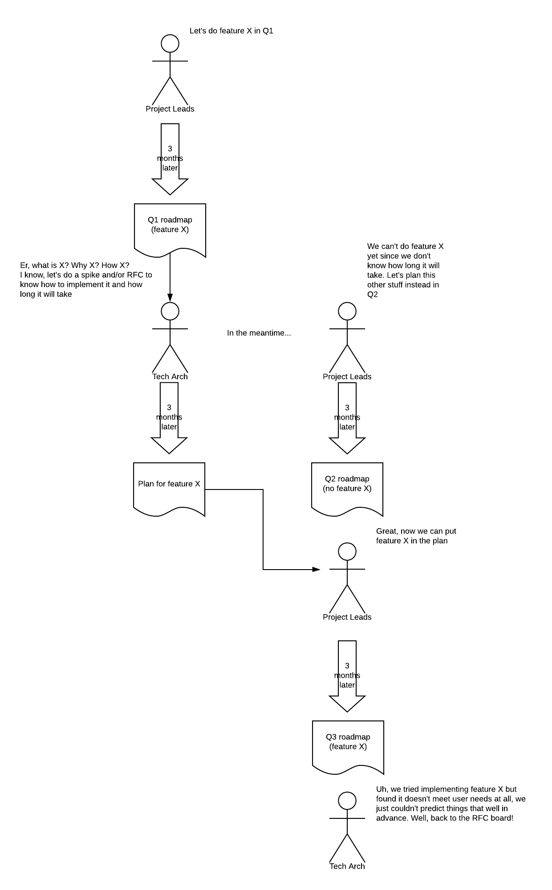

### DCP PR:

***Leave this blank until the RFC is approved** then the **Author(s)** must create a link between the assigned RFC number and this pull request in the format:*

`[dcp-community/rfc#](https://github.com/HumanCellAtlas/dcp-community/pull/<PR#>)`

# Roadmaps and Planning - an alternative perspective

## Summary

This informational RFC describes problems with the roadmaps and planning RFC where it concerns software
development. It then proposes alternative approaches. This is the author's own point of view.

Please note: the list of reviewers chosen is somewhat arbitrary based on my memory of who concerns themselves with this
stuff. And Github limits the number to 15. Apologies if I left you out - guaranteed I'd like you to read this even/esepcially 
if you strongly disagree.

## Author(s)

[Justin Clark-Casey](mailto:justincc@ebi.ac.uk)

## Shepherd
***Leave this blank.*** This role is assigned by DCP PM to guide the **Author(s)** through the RFC process.*

*Recommended format for Shepherds:*

 `[Name](mailto:username@example.com)`

## Motivation

Roadmaps and planning are the crankshaft of the DCP. If we don't create a crankshaft suitable for the engine of development 
then the DCP will run inefficiently or not at all. I'm concerned that the proposed process for creating these roadmaps and plans, as 
described in the Roadmaps and Planning RFC and as an evolution of the current process, does not fit DCP organizational and development realities.

This RFC describes the problems and promotes alternative solutions, as a response to being asked to write these up. It's 
nowhere near as comprehensive, well-written or referenced as I would like - unfortunately I've had many other priorities
to attend to. Nonetheless, I hope it can help spur constructive discussion on these topics. It is the author's personal
point of view as a technical lead and someone with long experience in highly distributed open-source projects that require co-operation
between peer organizations and individuals.

## Detailed Design

From my understanding, the roadmaps and planning RFC details a 70 day process where scientists, project leads, product owners, user experience
experts and technical leads create a roadmap consisting of themes, each theme having one of more objectives. These 
objectives are further described by user stories. Each objective is represented in the DCP Zenhub board as an epic with
user stories represented by an item attached to the epic. Further items can be created as spikes to spend time clarifying
the user stories and/or performing design work prior to implementation. Each item is assigned a milestone where there are
3 milestones of equal length in a quarter.

In my experience of the existing planning process almost all spikes are cross-component issues. DCP culture practically
 mandates that these require an RFC. An RFC
takes a minimum of 3 weeks from inception to approval, though realistically RFCs of any complexity require considerably
more time to understand the problem and align with other planned and existing technical work.

Again in my real-world experience on the DCP thus far, if an RFC is required this means that it will take a minimum of 2 milestones (8 weeks)
before it can be considered complete. A T-shirt estimate is only possible once the RFC is approved and there is a
strong chance that estimate will be more than the remainder of the quarter (4 weeks). Which means it takes an entire
quarter to plan work and you can only start it in the next quarter at the earliest. Even then, the roadmap process for
that next quarter will have started long before so in the worst case it could be *up to 9 months between planning and implementation*.
In other words, we have a waterfall of roadmapping, planning and implementation with an extremely long cycle time.

I have grave doubts about doing down this road for two reasons:

* **Prediction is hard** - predicting what software you need to create is hard. It's harder the further out you try. 
Suprisingly soon even the roughest prediction is impossible.
* **Science is unpredictable** - the requirements for the HCA shift. The science changes unpredictably.

Let's say we've gone through the process of planning shown above. Or less provocatively, let's say it takes just (!) 3 
months to get from plan to implementation attempt. When we come to that attempt a number of things could happen.

1) We find that the implementation doesn't deliver what the user needs. We thought we understood the problem but we actually didn't 
because we didn't test that understanding against reality. Now we have to cycle around for
another quarter (or even longer!) whilst we amend the design.
2) The design no longer meshes with the rest of the DCP. Other components have moved on and now this design needs significant
rework. If this is an RFC then that's another quarter or more gone.
3) The people who wrote the design have moved on (or simply forgotten their original ideas). RFCs are written documents, 
not code, so they are not guaranteed to capture the essence of the problem or the solution. Reviewers can't catch 
these because the DCP is too complex for anyone to grasp all the details. We no longer know the full thinking behind the
solution or critical fine implementation detail.
4) The science has changed so what we planned is no longer relevant. On the one hand this may be a good thing - we didn't
spend implementation time on it. On the other it may be bad - we spent time planning something when we could have been
doing other work of surer value instead.
5) The design was still relevant. It needed no major revisions. On implementation we find it accurately addresses the user's need
with little or no need for corrective work to fulfill the user story. Everybody is happy.

In my experience, the last scenario is the rarest case. To me, this is a big reason for why agile came about in the
first place - from the need to be adaptable to customer requirements and to fail fast so we can find what does work. A 
process where major work takes a half a year or longer to get from planning to execution is not an agile process. 
  
It's such an orthodoxy nowadays that nobody does waterfall unless they must (a contentious statement perhaps
though I've seen that sentiment in RFC reviews). So why is it being proposed here? From my perspective it's because of
these challenges:

* **High complexity** - the DCP feels highly complex. This makes for a very difficult management problem.
* **Siloed teams** - A team works on and owns its own components. Getting other teams to act means negotiation.
* **Constrained communication** - plenary voice communication is tightly constrained to an hour per day. This constrains
communication both between DCP groups with the same role (e.g. ingest, analysis, azul dev groups) and up and down
the objective to implementation work stack (e.g. between developers and product owners, between product owners and 
project leads).
* **No overall control** - no organization is in overall control.
* **Cultural variation** - organization's planning and development culture varies.

Cross-component dependencies are hard to manage
and time-consuming. It is easier to do a very sub-optimal local implementation rather than an extensive, time-consuming, 
stretched out and possibly unsuccessful simultaneous negotiation with many other teams.

All these encourage an approach that is waterfall, negotiation and tight alignment where design and implementation
are separated by long stretches of time. But I think that this falls foul of my earlier proposed tenets - prediction is hard and science is unpredictable.

When reality meets an ill-fitting process something has to give. As a practical consequence, I think that agile will take place
"under the covers". It will happen because it has to in order to get things done but despite the process rather than
because of it. We already see this today where in reality, implementation of 
RFCs has to start before they are approved in order to meet deadlines in an unpredictable environment and gain 
knowledge about whether the approach will really work. With work such as reliability, we simply don't know what makes
sense until we do other work first - it's just not possible to plan a long time in advance if you don't want to waste
time confabulating detailed written plans that you know aren't worth the pixels they're displayed on.

I am not saying that planning and RFCs are not worthwhile. There is no question that we face complex problems
that need advance thinking. But I feel that we're heading towards a place where there are simultaneously too many RFCs for
anybody to review and not enough to tackle the complex problems that we face.

### Alternatives

So what could be the alternatives? I am going to propose several actions which I think could be implemented separately but
 may be most powerful if they are all implemented together.

#### Management by aims and indicators

This approach tries to resolve the problem of *constrained communication* by working to indicators and broad aims rather than
detailed quarter by quarter objectives as detailed in [Human Cell Atlas DCP: Strategy](https://docs.google.com/document/d/1hBsj2BB9SjuJHodS3hM7cRJzXc5x-uYdOQL3LtGjYWM). 
Project leads set and review the aims and indicators in their role as leaders of the project. Detailed planning is still very much
necessary and desirable, but this responsibility is fulfilled by product owners working in conjunction with tech leads
and developers. The quarter by quarter roadmap still exists but is more theme than detail based, and is owned solely
by product owners aided by project managers. Success is judged on how well we meet the indicators over time, *not* by whether the DCP fulfilled a specific
objective.

This is to preserve agility - the ability to adapt objectives over short timeframes, ideally days or even less. This is for 
[core agile reasons](https://agilemanifesto.org/); individuals and interactions, working software over documentation, 
customer collaboration over contract negotiation, responding to change over following a plan. Especially in this 
project, we uncover new information all the time, we realize on contact with constantly evolving scientific reality that 
our plans won't work, we realize that actually this thing has high and immediate importance compared to this other thing.

I think that the important thing here is communicating these changes and shifting priorities to everyone else.
Following a plan that dissolves on contact with reality should be secondary. Managing by indicators and broad aims
rather than detailed tasks allows us to adapt *and* gives us yardsticks to measure whether the DCP is really delivering
user value or not. It removes the perceived need (whether true or not, perception is reality) for any change to require
consultation and associated delay up to project leads and back, which acts as a strong drag on decision making.

Project leads can still act as product owners but need to be very clear, both to themselves and others, when they are
wearing this hat and when they are wearing the product owner hat. When they're acting in their product owner role
they should be careful not to overrule other product owners whether consciously or not. 

Naturally, aims and indicators are likely not a paerfect solution. Whilst they have pros:

1) Allows teams to adapt quickly to changing circumstances without a formal planning cycle and communication up and down
the planning stack, as long as the metric is still valid.

They also have cons:

1) Metrics themselves can become a point of inflexibility. There needs to be a mechanism by which bad metrics can be
recognized and changed.
2) It may not be possible to create metrics for some objectives. This could mean the objective is not clear enough.

Nonetheless, I believe that management by aims and indicators is a management framework that we need to try.

#### Theme teams

Currently, work is split amongst institutions on component boundaries
(e.g. ingest development at the EBI, analysis at the Broad, data browser at UCSC, etc.). In theory, there are well defined
interfaces between them which reduces the need for communication, tackling the *constrained communication* and 
*high complexity* problems.

In practice, the touch points between teams are much more extensive than the APIs. It encompasses the whole data model -
a change in a bundle (e.g. adding library entities in ingest) will need preparation and agreement by all downstream
components. The data model is largely undefined, having emerged de facto from the implementation. This makes it brittle.

The by-component split also means that all big changes (e.g. AUDR) need extensive negotiation between teams. 
Charters have benefits but also encourage a culture of "not our problem" because a particular requirement isn't in a 
charter. It is often easier to do a local sub-optimal implementation than engage in negotiation which may not be successful.

An alternative approach is a radical reorganization of the DCP into theme teams drawn from annual roadmap
objectives rather than per component group. A theme team is now responsible for their roadmap theme and the features
that derive from it. They can make
changes in any component. Each team is responsible for both their feature and the working of the DCP as a whole.

Make no mistake, there are considerable challenges with this approach. It requires more communication, which will be 
a particular problem for the EBI to CZI and UCSC. I think this is surmountable - community open-source projects often have a 
very wide distribution but can still co-ordinate decisions. Often this is through tools such as mailing lists rather 
than real time, which will require a development culture change.

There is also an argument that the knowledge required by feature teams, teams that cross component boundaries, is 
simply too great - the DCP is just too complex to be understood by a single person. But I think that with the current
DCP organization, complexity is high *because of* component boundaries rather than in spite of them. Not because
partitioning complexity isn't a good idea, it absolutely is. Rather the correspondence of institutions to components
mean that the incentives (local camaraderie and reward) of sticking to your component are very high.

Hence we often adopt solutions that are local maxima but are very poor solutions for the DCP as a whole. We create
local databases because it's easier than trying to get cross-DCP co-operation. We contort ourselves to match
other component's APIs and data models because attempting change is just too difficult.
 
A theme team that's considering the DCP as a whole may be able to make decisions
that optimize across the whole of the DCP rather than for an individual component at the greater expense of others.

In addition, theme teams have greater flexibility to adapt to changing user circumstances and implementation discoveries
than per-component teams, especially if they are working to an indicator rather than detailed roadmap goals.

Pros:
1) Theme teams can consider implementations that optimize across the whole of the DCP, rather than being incentivized to
optimize their local component at the expense of cross-DCP optimization.
2) Theme teams are more flexible to adapt their work as circumstances emerge and change, rather than requiring a 
planning cycle.
3) It may be easier for developers to move between theme teams as required, rather than being tied to components that
face varying workloads.
4) It will be easier to create theme teams to work on cross-cutting DCP objectives, such as metrics of reliability or
whole-DCP dashboards.
5) More developers get a chance to lead if there are theme teams.
6) Theme teams grow their familiarity with the DCP as a whole. There are no longer per-component silos, though one 
would have to avoid per-theme silos emerging.

Cons:
1) Communication has to become more asynchronous and/or the overlap between UK and US West Coast day has to be increased
as much as possible bearing in mind cultural variation and work-life balance.
2) Theme teams may be smaller than per-component teams - developers moving teams may be a political challenge.
3) Theme teams may be more isolated. For example, if 3 members are in the US and only 1 in the UK.
4) It's a risky change that requires commitment and adapation across the entire DCP. To reduce the risk it could be
done first on an experimental basis with a single team, or even done partially with smaller 'maintainer' teams still
nurturing the individual components.

#### Best practice is evangelized rather than mandated
This approach recognizes that there is *cultural variation* between teams. It assumes that imposing a process will not bring
alignment because there is *no overall control*. Teams also face different circumstances which means one size will not
fit all. Alignment is valuable but comes about through evangalization, discussion of shared problems and spontaneous convergence.

Pros:
1) Teams can adapt their workflow to fit their circumstances, both at the present time and as those circumstances 
change over time.
2) Alignment is strong because it comes about through choice and agreement.

Cons:
1) It's more work for project managers since the scope for tracking status automatically is reduced as team
workflows are less aligned.
 
#### A culture of individual empowerment
People are afraid to take risks in this project, despite our encouragement. I've seen this many times in my relatively
short time with the DCP. Why is this? One reason is that people find the de facto mechanism of cross-component change,
the RFC, extremely daunting. It's:

a) Formally structured so one needs to spend a lot of time writing it.
b) Going to be reviewed by a lot of people, you need to get it right or you'll look stupid. Both content and form.
c) Going to generate a metric ton of discussion that will take weeks to understand and wade through.
d) Get approved but then sit around because implementing it isn't a priority. 
e) All the problems with long planning before implementation above.

This makes people afraid to write RFCs and makes technical decision making very slow, in addition to the crawl of the planning process.

I'm not sure I have a great solution here. I don't advocate getting rid of RFCs entirely because they do spur 
discussion, at the very least. But I do think that a) the bar to creating them should be a *lot* lower and b) the
presumption should be that you *don't* need an RFC. Get together the smallest possible group and get on and do something.
Of course, the latter is hard and can lead to real disruption. This is where you need a well-designed system, both 
in process and software, that can accommodate change without breaking down. We're taking some steps towards this, such
as with the ability to perform metadata changes that are temporarily held back from consuming components, but we need
to think of this as a systematic design construct, both going forward and in revisiting existing major architectural
decisions. We need to invest in these areas.

#### A culture of writing just enough
On the one hand, we have processes such as RFCs which have become practically mandatory for cross-component change. On
the other hand, critical details such as cross-DCP data models have been left completely unspecified.

This is unbalanced. I believe we should reduce the upfront documentation to the bare minimum but have a culture of 
writing down the critical details both before implementation and shortly after the dust has settled. This will improve
autonomy (fewer reviewers of unimportant details) and understanding across the DCP with documents that cover critical 
information but avoid obscuring details.

#### A final plea for agility
Waterfall development is an understandable approach to the constraints of the DCP as listed previously but I 
don't think that it's the right one. There's no question that agility in these circumstances is hard and may require
some novel solutions. And the approaches I've outlined will undoubtedly themselves have considerable flaws and risks.
But I think the costs of rigidity in this project will be very high and I decades of 
software practice have shown that it rarely works. I urge us to consider more radical solutions to our problems before
instituting further restrictions on change.  

### Acceptance Criteria [optional]

As described above, I advocate establishing indicators and then managing by them for 6 months. At this point we can 
assess this process both quantitatively - are our indicators improving?. And we can assess qualitatively, do we feel
this process is giving users more value than our previous processes?

### Unresolved Questions

Lots more I'm sure.

### Drawbacks and Limitations [optional]

Lots more I'm sure.

### Prior Art [optional]

The DCP member survey may be an additional touchpoint. After the presentation has anybody acted upon the results in an
explicit way?

### Alternatives [optional]

Approve and continue with the roadmaps and planning RFC as written. This proposal can still be kept as one source of radical
alternatives if that RFC fails to meet its goals, though I strongly suggest thinking very carefully as to whether 
doubling down on a waterfall-like process is going to fix the problems with DCP development.
