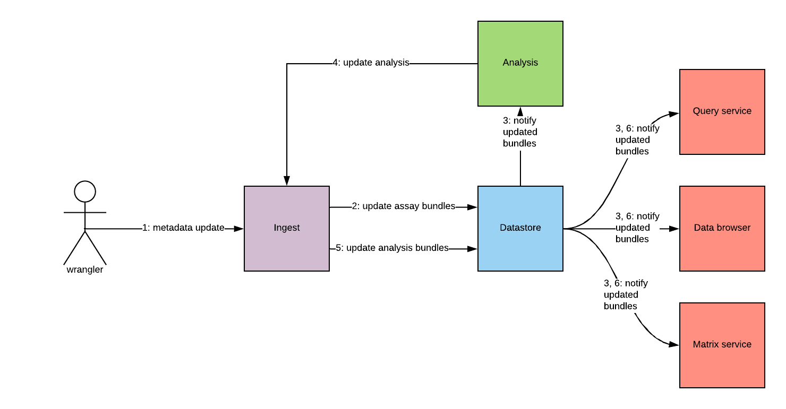
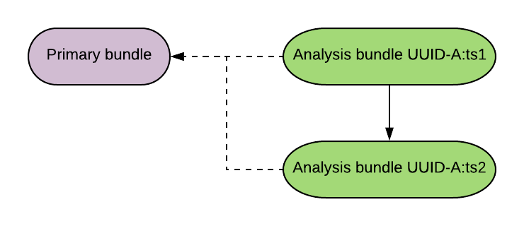
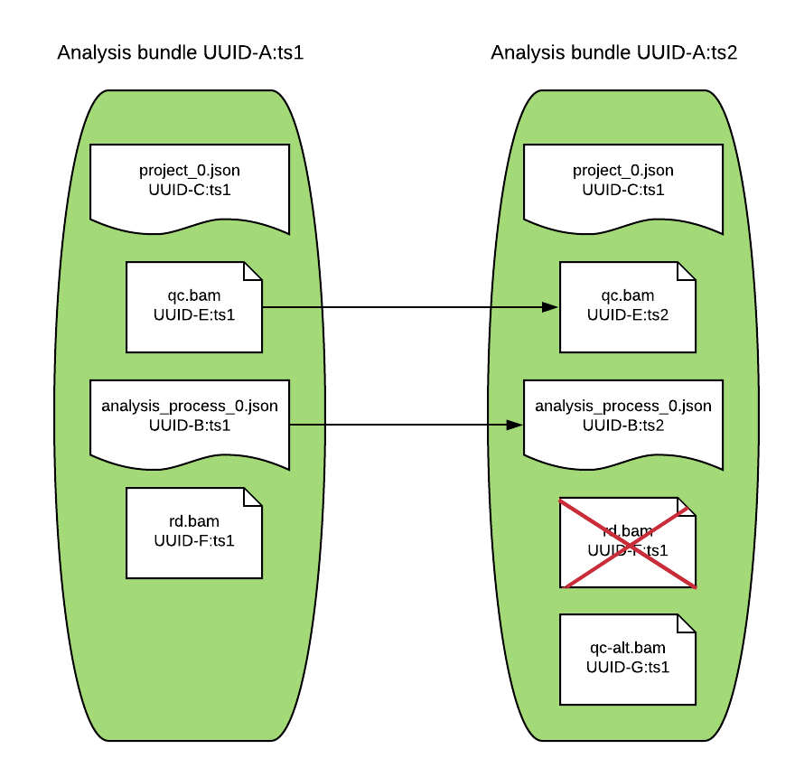
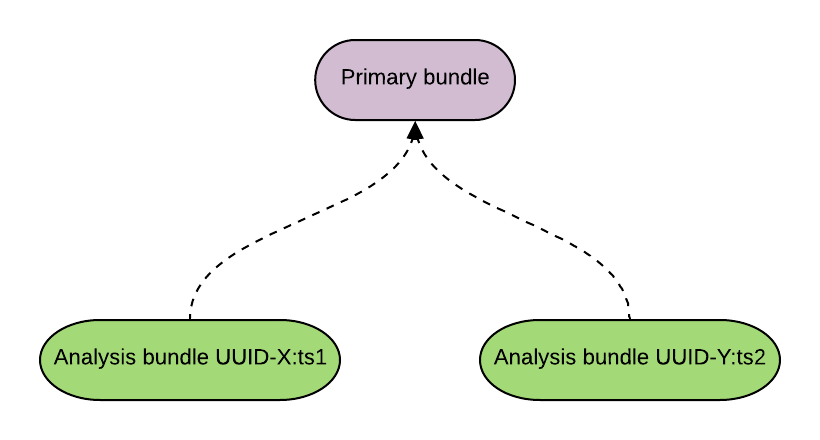
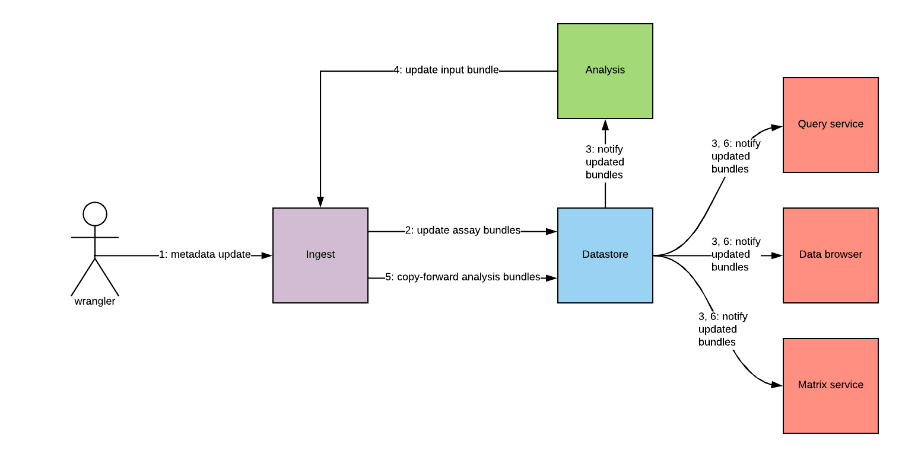
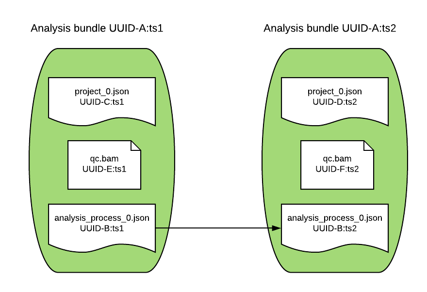

### DCP PR:

***Leave this blank until the RFC is approved** then the **Author(s)** must create a link between the assigned RFC
number and this pull request in the format:*
`[dcp-community/rfc#](https://github.com/HumanCellAtlas/dcp-community/pull/<PR#>)`

# RFC Name
AUDR Analysis Updates

## Summary
Enable analysis to update previous analyses and add new analyses alongside existing analyses.

## Author(s)
[Justin Clark-Casey](mailto:justincc@ebi.ac.uk)

## Shepherd
[Parth Shah](mailto:pshah@chanzuckerberg.com)

## Motivation
This covers [use cases](https://docs.google.com/document/d/1rI8PCASomdAHznyWQceRJGv4-wtg-P5Rm-rI_uJLjtE/edit#):

* **Fix an incorrect metadata field (e.g. cell count)** where the change can trigger re-analysis.
* **Fix an incorrect ontology term** where the change can trigger re-analysis.
* Fix incorrect analysis using a corrected pipeline.
* **Add better analysis using an improved pipeline.**

Wranglers consider the **bolded** use cases in red to be critical for general availability.

## Detailed Design
A primary metadata update triggers a datastore notification. Per pipeline, Analysis performs:

* **Update analysis.** The [meta]data change is in a file or parameter that updates an existing analysis (a “consequential” change).
* **New analysis.** The [meta]data change creates a new analysis. For example, the species changes from mouse to human and there is a pipeline for human on this data but not one for mouse. It may be that an analysis from a different pipeline already exists and this should not be superseded by the new analysis.
* **No update.** There is an existing analysis for this pipeline but the [meta]data change does not alter the analysis (an “inconsequential” change). For example, a change in the project description.

The **update analysis** and **new analysis** scenarios can occur without a primary update. For example, a pipeline bug may be fixed which requires updates of the analyses it performed. Or a new pipeline may be created that can be run on existing data, where the existing analyses from other pipelines are still valid and so should not be superseded.

### Update analysis

A bundle for an updated analysis will have the same UUID as the existing analysis. This will tell consuming components that the bundle with the later timestamp in its version supersedes those with earlier timestamps. The bundle relationship looks like this:

To submit an updated analysis, Analysis will:

1. Create a submission envelope with the parameter isUpdate = true.
2. Add `analysis_process_0.json` with provenance.document_id set to the same UUID as the existing `analysis_process_0.json`
3. For other files that need updating, also add them to the envelope with the same provenance.document_id as their previous versions`.`
4. For files that only exist in the new analysis, add them to the envelope with any provenance.document_id.
5. For files that exist only in the older analysis, post an HTTP DELETE to their endpoint.
6. For files that are in both envelopes but don’t need updating, do nothing.

To make it easier for analysis to supply the existing UUIDs, they will also be able to set the provenance.document_id when the file is first created.

### New analysis

This is the same as the new analysis implementation today which is triggered by a new primary data bundle rather than an update. If the new analysis should not supersede an existing analysis, for example if that existing analysis comes from a different still valid pipeline, then the relationship between such bundles will look like this:

### No update

To perform copy-forward, Analysis tells Ingest that the input primary bundle for analyses is updated.

The update mechanism will be the same as for actually updating the analysis, except that they will change only the input_bundles parameter when posting the `analysis_process_0.json.`

## Acceptance criteria
*  Analysis can update existing analyses.
*  Analysis can submit new analyses which do not supersede existing analyses.
*  All primary data and metadata in analysis bundles is updated in response to a primary data or metadata change.

## Alternatives

### Only analysis_process_0.json requires same UUID on updates
Instead of requiring all file actions to be specified when submitting an analysis update (update, delete or create), Analysis would only need to specify the same UUID for `analysis_process_0.json`. All other files could be specified with new UUIDs. At the bundle level, all the original files bar `analysis_process_0.json` would be deleted and new files and references to files created.

The advantage here for analysis is that only one relationship needs to be specified. If the UUID could be generated from other parameters, it may mean Analysis doesn’t need to store UUIDs or any other information about files generated by a previous analysis.

The problem here is that actions are still required to delete all those old files before creating them anew. If Analysis does this, then it needs to know the file UUIDs anyway. If Ingest provides a convenience method, such as delete all the files **except** for `analysis_process_0.json`, these opens the way for bugs and arguably starts to put some intelligence about bundle changes into Ingest.

There seems to be a better separation of responsibility if Analysis is solely in charge of maintaining file relationships between bundles. This also means that this information will be present from the outset - it’s possible that file relationship information is valuable to preserve.

### Ingest copy-forwards immediately
Instead of Analysis telling Ingest to perform a copy-forward on no analysis, Ingest performs copy-forward automatically on all bundles as soon as it receives a primary update. If an analysis is updated then Ingest needs to manage this so that it a) doesn’t clash with any analysis bundles already going on from the initial primary update and b) both the analysis update and the copy-forward are correctly performed on the updated analysis bundle.

**PROS**
1. It’s less work for all non-primary submitters. They don’t need memory and mechanisms to signal the no analysis case.

**CONS**
1. Ensuring serialization of bundle updates becomes critical. We do not want to risk interleaving a copy-forward with a possible analysis.
2. Ingest will need to do much more work, meaning greater resource consumption (or crowding out) and higher fragility. Any primary data update will start bundle updates that need to be repeated if an analysis comes in.

### Analysis declares fields of interest

Analysis pre-declares to Ingest the metadata fields on which it will update analyses. If a primary update comes in that changes none of those fields, Ingest goes ahead with copy-forward on the analysis bundles automatically.

**PROS**
1. Less work for non-primary submitters. They don’t need mechanisms to hold and convey no updated analysis information.

**CONS**
1. Ingest needs to hold and preserve this information. It needs to provide an authenticated CRUD API for declarations.
2. Analysis needs to declare fields of no interest to ingest. This is a fragile because Analysis may accidentally not declare some fields or over-declare and never trigger copy-forward.

# References
* [Add new data and metadata to existing projects (AUDR) #414](https://app.zenhub.com/workspaces/dcp-5ac7bcf9465cb172b77760d9/issues/humancellatlas/dcp/414)
* [Results from “The AUDacity of Hackathons” (June 2019 HCA DCP F2F session)](https://docs.google.com/document/d/1ifzy4lQtdIm0NvDpEuuQ2tD8ku9IPvn7sPjOg9BhliA)
* [Data model pre-RFC](https://docs.google.com/document/d/1CdIJ_pBdiiQUFh8kYARRhMXvhKXGERG3bdv763tpAKI/)
* [Tech Arch: Handle notifications for insignificant bundle updates](https://docs.google.com/presentation/d/1_snBHeCVPjLmgZPKH2SbHk_I3-s6jLlEkPtz0eUY_Xc/edit?ts=5cfa7ddc)
* [AUDR usecases](https://docs.google.com/document/d/1rI8PCASomdAHznyWQceRJGv4-wtg-P5Rm-rI_uJLjtE/edit)
* [Analysis updates and Q2 testing (AUDR) 2019-07-17](https://docs.google.com/presentation/d/1iZOoVYy4t3cG0VUMEj0swe9BfGJJ4_G1L4XOgvxSRvY)