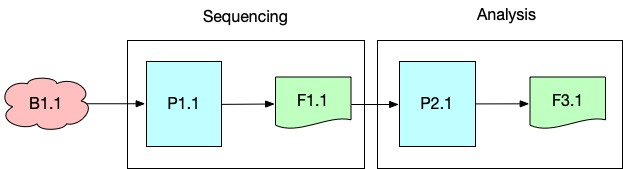
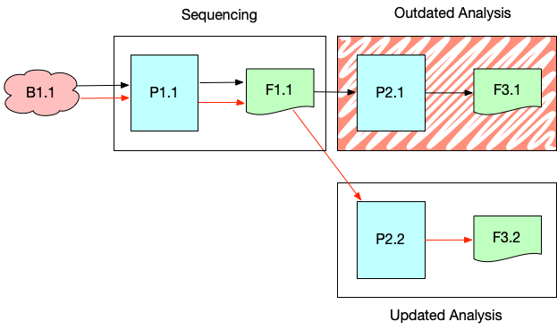
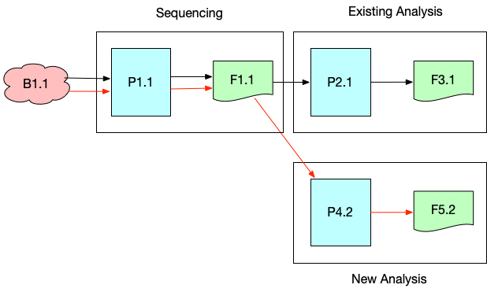
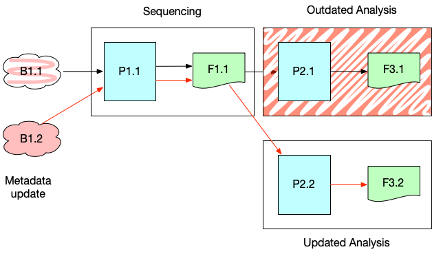
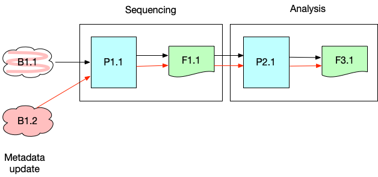

### DCP PR:

***Leave this blank until the RFC is approved** then the **Author(s)** must create a link between the assigned RFC number and this pull request in the format:*

`[dcp-community/rfc#](https://github.com/HumanCellAtlas/dcp-community/pull/<PR#>)`

# RFC Name

Versioned Experimental Data Structure Conceptual Model

## Summary

This document described the conceptual model of the HCA DCP experimental data and associated metadata.  This is an informational RFC that covers how to interpret the experimental data graph considering multiple versions of the data and metadata.  It does not cover content-specifics, including schema or storage format.

## Author(s)

[Mark Diekhans](mailto:markd@ucsc.edu)

## Shepherd
***Leave this blank.** This role is assigned by DCP PM to guide the **Author(s)** through the RFC process.*

*Recommended format for Shepherds:*

 `[Name](mailto:username@example.com)`

## Motivation
The goal of the experimental metadata is to capture a detailed, accurate representation of the experimental process and the scientific data within the DCP.  The experimental metadata is closely coupled to the experimental data and expected to evolve as experimental methods and consumer needs evolve.

The full scientific data content of the DCP is represented by the experimental metadata model, including all versions of data and metadata instances.  Programmatic access to all versions of metadata supports the exploration and analysis of the provenance of HCA data.

The addition of data and metadata update functionality (AUDR) has increased the complexity of the data model. A rigorous definition of the full data model is needed to communicate about and to interpret the versioned graph consistently and accurately.

### User Stories

As a DCP developer, to develop software to manage versioned data,
I would like to understand how to interpret the data and communicate with other developers in a clear and precise manner.

As a data operations engineer, to construct a data release, I would like to understand what specific data and metadata instances to include.

As a bioinformatician, to replicate an experiment, I would like to understand the provenance of the relevant data files from a data release.

## Detailed Design

The experimental metadata is structured as DAG of instances, with basic categories of *Project*, *Biomaterial*, *Protocol*, *Process*, and *File*.  Each of these types may have more detailed derived types.  This structure is defined in more detail in [Overview of Metadata Structure](https://github.com/HumanCellAtlas/metadata-schema/blob/master/docs/structure.md).

Conceptually, the full, versioned metadata graph consists of all metadata instance versions in the DCP.  However, there are multiple ways to traverse the graph based on the question being asked:

* Head graph: The top-down traversal of the most current version of metadata instances.  This does not include obsolete instances.  This view of the graph is normally used for browser and selection of the latest results
* Provenance graph: This is the reverse-traversal graph from a specific version of a metadata instance, visiting the exact versions of preceding metadata instances.  It records the context of an experiment when it was run.
* Amended provenance graph: The provenance graph with corrections that are inconsequential, such as correcting natural language descriptions.  This graph is used to produce data releases.

The head graph is the graph of the latest version of all the metadata, excluding those that are obsolete due to a restructuring update or those that are flagged as erroneous.  This is the view normally used in selecting data sets and exploring the atlas.  Traversing from the roots to result in a branching set of paths to the leaves.  Normally, this graph would be generated by traversing via UUID, ignored the version timestamps.

The providence graph gives the exact history of data and metadata as it existed at the time a given process was run.  This view provides the ability to analyze and understand an experiment.  It is a reverse traversal from leaves to roots following FQIDs of the input to each metadata instance as it existed at the time the leaf was created.  Since metadata indirectly upstream of a process may change without intermediary processes being rerun, the providence links are not simply the version of the direct input to a node at the time each metadata entity was created.  The upstream metadata change may have triggered a downstream rerun without intermediate processes being rerun.

The knowledge if an update will result in a new or amended analysis is not known by the ingestion process.  It will be determined by each analysis examining the update.

Figures 1-4 are some examples to illustrate the graph interpretation issues.  In each of these drawings, the graph node labels starting with B are biomaterials, those with P are processes, and with F are files.  The first number is the unique id, which is a UUID in practice.  The number after the dot is the version, which is represented as a timestamp.  Red squiggles indicate an outdated metadata instance.

Figure 1: Basic graph of sequencing and analysis.  This is a basic experimental pipeline with no updates. The head graph is obtained by traversing the graph from the root to the leaves.  The provenance of a given leaf is achieved by reverse traversing the edges.

Figure 2: Graph with an updated analysis.  In this case, an analysis is rerun for a reason other than an upstream change.  For example, this could be due to a bug be discovered in the analysis software.  The head graph is obtained by traversing the graph, ignoring the outdated nodes.  The provenance graph is for the new analysis is obtained by reverse traversing the edges shown in red and for the outdated analysis from the edges in black.

Figure 3: Graph with a new analysis:  In this case, a second, independent analysis is run.  This might be the case when a new different analysis algorithm is being used.  The head graph includes both analysis results.   The provenance graph is obtained by reverse traversing the edges shown in red.

Figure 4: Graph with an upstream consequential metadata change that triggers a reanalysis.  This is the case where there is an error in a metadata field that is used to parameterize the analysis. Here the sequencing didn't change, however, the downstream analysis was triggered by a change in the biomaterial metadata (B1).  The provenance graph reverse traverses the edges shown in red, going to B1.2 even though the process metadata P1.1 has not changed.

Figure 5: Graph with an upstream inconsequential metadata change that does not trigger a reanalysis.  Correcting natural-language descriptions or migrating the metadata schema are examples of this type of update.  Reverse-traversing the red edges gives the amended provenance graph.

The *Project* metadata entity is as a container for all metadata and data that is part of the project.  All data in the DCP belongs to at least one project.  A given metadata instance may be associated with more than one project, such as a sample sequenced by multiple projects. Derived projects can be created for an analysis that used data from multiple projects.

### Example use cases
These sections collect various use cases to illustrate how they are represented or are problematic for this model.

- Contributor discovers the wrong FASTQ was uploaded or a FASTQ is missing.  An update to the primary bundle is submitted with a replacement or new FASTQ.  This is a consequential change to analysis and will result in a new provenance graph.

- Change in B1 in a metadata field that is used to parameterize the analysis so analysis is triggered but the outputs (F3) from analysis & re-analysis checksums are identical.  It would be desirable for the user to know the results are not changed with the new parameters.  This is not currently representable.  The users would have to detect themselves.

- The similar case of updated software or parameters (P2) causes re-analysis but the outputs have identical checksums.

### Unresolved Questions

- Does this present a clear and rigorous model for interpreting multiple version of data for developers and advanced users? 

- How should the re-analysis not change results be modeled?

- Is the graph external to the metadata entities, allowing them to be shared by multiple nodes in a global graph, or are the entity instances the nodes?  That is, are the entity instances attributes of the nodes or the nodes themselves, forcing them to be in only one graph?  The current implementation with links.json supports both models, however, this needs to be explicitly defined.

- How are projects versioned? Currently, the only project version is the version of the metadata instance, which doesn't reflect the contained data.  Is project versioning need beyond releases?

- While this is intended to be an information RFC, what are the impacts on DCP software if any?

