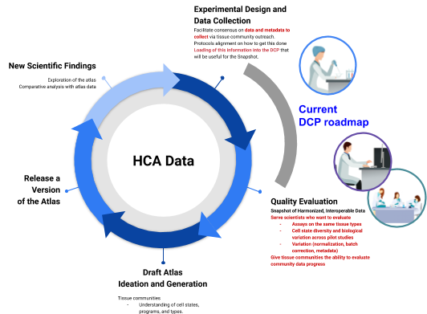
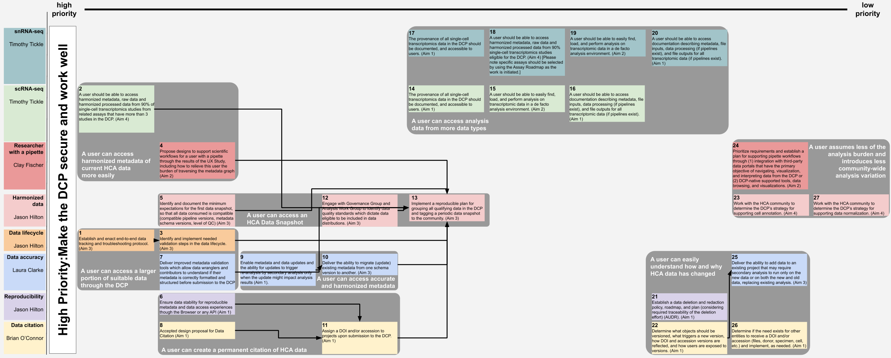

### DCP PR:

`[dcp-community/rfc#](https://github.com/HumanCellAtlas/dcp-community/pull/<PR#>)`

# DCP Product Roadmap

## Authors

[DCP Project Leads](mailto:project-leads@data.humancellatlas.org)

## Shepherd

[Cara Mason](mailto:cara@broadinstitute.org)

## Prioritized Themes

### Critically Important Themes

- [scRNA-Seq](#scrna-seq)

- [snRNA-Seq](#snrna-seq)

- [Researcher with a Pipette](#researcher-with-a-pipette)

- [Data Accuracy](#data-accuracy)

- [Harmonized data](#harmonized-data)

- [Data Lifecycle](#data-lifecycle)

- [Reproducibility](#reproducibility)

- [Data Citation](#data-citation)

- [Compliance Roadmap](#compliance-roadmap)

### Important Themes

- [Researcher with a Keyboard](#researcher-with-a-keyboard)

- [Feature Barcodes](#feature-barcodes)

- [Key Performance Indicators](#key-performance-indicators)

- [DevOps Improvements](#devops-improvements)

- [Security Improvements](#security-improvements)

## Summary

### Why a Data Coordination Platform (DCP)?

We are creating the Human Cell Atlas DCP to provide a platform for biological scientists to share, organize, analyze, and interrogate single-cell data, helping these scientists create comprehensive reference maps of all human cells.

In the long term, the DCP aims to provide the following (from the [Human Cell Atlas DCP:
Strategy](https://github.com/HumanCellAtlas/dcp-community/blob/master/strategy/specific-aims.md)):

**Aim 1**. Create a harmonized interoperable data resource that maximizes the value and use of Human Cell Atlas data across the scientific community.

**Aim 2**. Provide researchers access to data that will enable the Human Cell Atlas to answer fundamental questions in all aspects of biology.

**Aim 3**. Perform regular data releases of high value to single-cell researchers

**Aim 4**. Build alignment amongst the Human Cell Atlas community around a core set of computational methods and analyses.

**Aim 5**. Create standards to describe single-cell experimental designs, including protocols, sample collection, technologies, and assay types.

### Prioritizing Aims: Connecting data generation to the community

We view the current goal of the DCP as a resource of valuable data to the community. This is a step prior to the drafting of an Atlas, generation of which is an iterative process with at least 5 stages (figure below). The current roadmap prioritizes the support of the scientists working on the first two stages: *Experimental Design and
Data Collection* and *Quality Evaluation*. First, HCA researchers are currently assembling people and processes to collect and assess what data is available. Second, researchers are evaluating the quality and interoperability of data.

### Prioritizing Users: Supporting the foundations of an atlas

<table>
<thead>
<tr class="header">
<th><strong>WHO ARE THESE PRIORITIZED SCIENTISTS?</strong></th>
<th></th>
</tr>
</thead>
<tbody>
<tr class="odd">
<td>

<strong>Tissue communities generating the data that will comprise the draft atlas.</strong>

 
</td>
<td><strong>Computational scientists investigating how data from multiple studies could be integrated into an atlas.</strong></td>
</tr>
<tr class="even">
<td><strong>WHAT DO THESE SCIENTISTS NEED?</strong></td>
<td></td>
</tr>
<tr class="odd">
<td>Tissue communities need a common space to store, measure, and describe data that provides the ability to inventory the progress towards generating each tissue atlas.</td>
<td>Access to datasets produced under different conditions or using different assays that can be used to evaluate data interoperability through assessments of data quality and biological coherence.</td>
</tr>
<tr class="even">
<td><strong>WHY DO THEY NEED IT?</strong></td>
<td></td>
</tr>
<tr class="odd">
<td>
Researchers need to be able to access and compare their experiments to those of their colleagues to understand how to generate the highest quality data and assess when collected data is adequate to support a draft tissue atlas. They also need to reference this data in publications.

</td>
<td>In drafting an Atlas, researchers need access to data that enable them to (1) evaluate the quality of the data across experiments and (2) develop an initial framework for cell types and states.</td>
</tr>
<tr class="even">
<td><strong>HOW WILL THEY DCP SERVE THE HCA COMMUNITY?</strong></td>
<td></td>
</tr>
<tr class="odd">
<td><ul>
<li><blockquote>

Partner with the communities on standard data representations

</blockquote></li>
<li><blockquote>

Give the ability to access and understand what data have been collected and is available, through both the DCP and downstream applications

</blockquote></li>
<li><blockquote>

Provide the ability to cite for each contribution

</blockquote></li>
<li><blockquote>

Increase the availability of data for interoperability assessments

</blockquote></li>
<li><blockquote>

Release curated, harmonized and interoperable data

</blockquote></li>
</ul></td>
<td></td>
</tr>
</tbody>
</table>

## Prioritized Themes
[prioritized-themes]:#prioritized-themes

To serve the HCA community and accomplish the above goals these themes and dependencies will need to be realized. 

*See this [graphical representation](https://docs.google.com/drawings/d/1Wywik7RvdBiCJh6s_eVjfGaa2i0BioZau8Iksv6wAbo/edit) that reflects prioritization of the themes detailed below.*

### Critically Important Themes
[critically-important-themes]:#critically-important-themes

#### [scRNA-Seq](https://docs.google.com/document/d/1xUyGu1MxCopmMIY802ioB0izXZChBazhJlu3dMsL2fU/edit)
[scrna-seq]:#scrna-seq 

**Contacts**: Timothy Tickle, Kylee Degatano

**Summary**: Scientists need access to single-cell transcriptomics measurements from humans and model species, so they can incorporate transcriptomic signatures into analysis characterizing tissues.

**Objectives:**
    
1.  A user should be able to access harmonized metadata, raw data and harmonized processed data from 90% of single-cell transcriptomics studies from related assays that have more than three studies in the DCP. (Aim 4)
        
    This data can be processed from pipelines that are standard, beta, or community contributed.
        
    Please note specific assays should be selected by using the [Assay Roadmap](https://docs.google.com/spreadsheets/d/13T7RKt9PDxJzASu36QnSbKov2jzOmCM9lnSP4zbyi2w) as the work is initiated.
    
1.  The provenance of all single-cell transcriptomics data in the DCP should be documented and accessible to users. (Aim 1)
    
1.  A user should be able to easily find, load, and perform analysis on transcriptomic data in a de facto analysis environment. (Aim 2)
    
1. A user should be able to access documentation describing metadata, file inputs, data processing (if pipelines exist), and file outputs for all transcriptomic data (if pipelines exist). (Aim 1)
---
### [snRNA-seq](https://docs.google.com/document/d/1zmfFXNWI1Kx0EEvlhB2SB_FBu_iLJ-9wsD4rUyqaaOk/edit)
[snrna-seq]:#snrna-seq 

**Contacts**: Timothy Tickle, Kylee Degatano

**Summary**: Scientists need access to single-cell transcriptomics measurements from tissues which were not processed directly from fresh tissue or cannot be processed as whole cells (due to the properties of the cells or surrounding tissues)(eg. single-nuclei transcriptomics), so they can perform analysis on all tissues in the human body including difficult tissues to acquire or process.

**Objectives:**

1.  A user should be able to access harmonized metadata, raw data and harmonized processed data from 90% of studies in the DCP that relate to this type of processing that has more than 3 studies in the DCP. (Aim 4)
    
    This data can be processed from pipelines that are standard, beta, or community contributed.
    
    Please note specific assays should be selected by using the [Assay Roadmap](https://docs.google.com/spreadsheets/d/13T7RKt9PDxJzASu36QnSbKov2jzOmCM9lnSP4zbyi2w) as the work is initiated.

1. The provenance of all processed data to raw data should be documented and accessible to users. (Aim 1)

1. A user should be able to easily find, load, and perform an analysis with transcriptomic data in a de facto analysis environment from each assay of this type. (Aim 2)

1.  A user should be able to access documentation describing metadata, file inputs, data processing (if pipelines exist), and file outputs (if pipelines exist) for all transcriptomic data of this type. (Aim 1)

1. A user should be able to access common quality control metrics used by the community who analyze this type of data. (Aim 5)
---

### Researcher with a Pipette
[researcher-with-a-pipette]:#researcher-with-a-pipette

**Contacts**: Clay Fischer, Galabina Yordanova

**Summary**: *Researchers with a pipette* need to easily find, access, and analyze data currently available from the DCP

**Objectives:**
    
1. Propose designs to support scientific workflows for a user with a pipette through the results of the UX Study, including how to relieve this user of the burden of traversing the metadata graph (Aim 2)
 
1. Prioritize requirements and establish a plan for supporting pipette workflows through (1) integration with third-party data portals that have the primary objective of navigating, visualization, and interpreting data from the DCP or (2) DCP-native supported tools, data browsing, and visualizations. (Aim 2)
---

### Data Accuracy
[data-accuracy]:#data-accuracy

**Contact**: Laura Clarke

**Summary**: A data consumer needs to be confident that the metadata and data that they are searching and accessing accurately represent the experimental and analytical procedures to produce the data.

**Objectives:**

1.  Enable metadata and data updates and the ability for updates to trigger re-analysis by secondary analysis only when the update might impact analysis results (Aim 1).

    *User Story:* As a data consumer, I want consistent primary, secondary, and matrix
    data/metadata so I trust in the data output of the DCP

1. Deliver the ability to migrate (update) existing metadata from one schema version to another. (Aim 3)

1. Deliver the ability to add data to an existing project that may require secondary analysis to run only on the new data or on both the new and old data, replacing existing analysis. (Aim 3)

1.  Deliver improved metadata validation tools which allow data wranglers and contributors to understand if their metadata is correctly formatted and structured before submission to the DCP (Aim 5)

1.  Enable multi-lane library sequencing experiments to be accurately represented by the DCP metadata schema by implementing a solution as defined by the [Representing sequencing library preparations in the HCA DCP metadata standard](https://github.com/HumanCellAtlas/dcp-community/blob/master/rfcs/text/0010-rfc-library-preparation.md). (Aim 5)
---

### [Harmonized data](https://docs.google.com/document/d/15yOxsQ_tx1qgoDgW1uMT30Sv076p8KmHDYrEoKEOLeM/edit#heading=h.c2wf4lrire5p)
[harmonized-data]:#harmonized-data

**Contact**: Jason Hilton

**Summary**: A data consumer needs to have harmonized data and metadata across multiple projects so they can extract information consistently across all projects and perform integrative analysis. The focal point of this theme is the delivery of a Snapshot to the scientific community. The objectives include requirements for a first Snapshot iteration, as well as exploring data analysis features that the DCP would like to incorporate in future Snapshots. Snapshots will be a curated collection of HCA data in the DCP at a given point in time, providing a common group of data for which the community to converge on with their analyses.

 **Objectives:**

1.  Identify and document the minimum expectations for the first data snapshot, so that all data consumed is compatible(compatible pipeline versions, metadata schema versions, level of QC) (Aim 3)

1. Engage with Governance Group and Analysis Work Group to identify data quality standards which dictate data eligible to be included in data distributions. (Aim 3)

1. Implement a reproducible plan for grouping all qualifying data in the DCP and tagging a periodic data snapshot to the community. (Aim 3)

1. Work with the HCA community to determine the DCP’s strategy for supporting data normalization. (Aim 4)

1. Work with the HCA community to determine the DCP’s strategy for supporting cell annotation. (Aim 4)
---

### [Data Lifecycle](https://docs.google.com/document/d/1uOYY-Rtru4hi6_ZDMEqQKLvmm-N0TRlYj1tf_WDjqWw/edit)
[data-lifecycle]:#data-lifecycle

**Contact**: Jason Hilton

**Summary**: The DCP needs an efficient data lifecycle in order to provide users with timely and reliable data. The goal of this theme is to decrease the time and effort required for data submissions. This begins with solidifying and documenting each step in the data lifecycle from the identification of a possible submission to ‘version-complete’ in the DCP. Once established, each step can be scrutinized for timing and issues which commonly cause delays. This will enable an implementation plan for optimization. The end result will be increased bandwidth for data coming in to the DCP, and thus, available to the community.

**Objectives:**

1. Establish and enact end-to-end data tracking and troubleshooting protocol. (Aim 3)

1. Identify and implement needed validation steps in the data lifecycle. (Aim 3)

1. Enable a layer of data accessibility available only to DCP members in order to allow project version-completeness and validation before releasing data, as described in Phase 1 of the [HCA Project completion stage](https://github.com/HumanCellAtlas/dcp-community/blob/master/rfcs/text/0015-project-completion-stage.md). (Aim 1)

1. Extend the unreleased layer of data accessibility for a given submission to the contributors of the data as described in Phase 2 of the [HCA Project completion stage](https://github.com/HumanCellAtlas/dcp-community/blob/master/rfcs/text/0015-project-completion-stage.md). (Aim 1).

1. Enable event notifications for version complete deposition of raw data and analysis processing results as described in [Data Groups: Processing Datasets that Span Multiple Bundles](https://github.com/HumanCellAtlas/dcp-community/blob/master/rfcs/text/0013-multi-data-collection-dataset-processing.md). (Aim 1)
---

### Reproducibility
[reproducibility]:#reproducibility

**Contacts**: Jason Hilton, Trevor Heathorn

**Summary**: The focus of this theme is data permanency. A fundamental requirement. Scientists who return to the DCP need to be able to have the ability to consistently retrieve the output of a previously accessed data set.

**Objectives:**

1. Ensure data stability for reproducible metadata and data access experiences though the Browser or any API (Aim 1)

1. Establish a data deletion and redaction policy, roadmap, and plan (considering required traceability of the deletion effort) (AUDR). (Aim 1)

1. Report on the cost-benefit analysis of modifying the DCP architecture to make the primary repository of metadata a transactional database rather than flat file storage ([Technical Objective](https://docs.google.com/document/d/1_0tjwSesZZ-53C9TnrTEtaf4H3aaVuzFdMvs-QtHJ3k/edit?pli=1#heading=h.w7c90d74seqq)). (Aim 2)
---

### [Data Citation](https://docs.google.com/document/d/1ggis5erTriJHkNrspn19eCIKAGnwj53-G-rIYpNURZg/edit#)
[data-citation]:#data-citation

**Contacts**: Brian O’Connor, Jason Hilton, Trevor Heathorn

**Summary**: Scientists need to be able to find cited data from the DCP so they can reproduce results generated from the DCP

**Objectives:**
    
1.  Accepted design proposal for Data Citation. (Aim 1)
    
1. Assign a DOI and/or accession to projects upon submission to the DCP. (Aim 1)
    
1. Determine if the need exists for other entities to receive a DOI and/or accession (files, donor, specimen, cell, etc.) and implement, as needed. (Aim 1)
    
1. Determine what objects should be versioned, what triggers a new version, how DOI and/or accession versions are reflected, and how users are exposed to versions. (Aim 1)
    
1. Use the citation process described in Objectives 1-4 in the Data Browser and Portal
---

### [Compliance Roadmap](https://docs.google.com/document/d/15yfkX0H3TGchMKLOTxqW1gCSMZ8Rrb2X04DHTabRC6M/edit)

**Contact**: Sarah Tahiri

**Summary**: The DCP needs a security and compliance roadmap for high-priority data so we can provide essential data and metadata for researchers

**Objectives:**

1. Understand DCP needs on access controls (data set prioritization), and the value of this data to the DCP. (Aim 1)

1. Identify and document the compliance requirements for open access data management based on laws and regulations applicable to data stored within the DCP system (e.g., GDPR). Compliance requirements resulting in technical work will be passed to appropriate product teams for incorporation into the DCP engineering plan. (Aim 1)

1. Identify and document the additional compliance requirements for registered access data management based on laws and regulations applicable to data stored within the DCP system (e.g., GDPR). Compliance requirements resulting in technical work will be passed to appropriate product teams for incorporation into the DCP engineering plan. (Aim 1)

1. Identify and document the additional compliance requirements for managed access data management based on laws and regulations applicable to data stored within the DCP system (e.g., GDPR). Compliance requirements resulting in technical work will be passed to appropriate product teams for incorporation into the DCP engineering plan. (Aim 1)

1. Determine against which standards the DCP must be evaluated (e.g., GDPR, FISMA Moderate, [Broad NIST checklist](https://docs.google.com/document/d/1NnE16doGC0UsxyD9_J94B4OdhjwQore4hRuG_lWJGpQ/edit), GA4GH guidance) and the priority for each evaluation. (Aim 1)

1. Leveraging deliverables from Objectives 1-4 as appropriate, and [data suitability policy](https://data.humancellatlas.org/contribute) conduct a baseline security controls assessment. Findings will be delivered to the appropriate teams (for policy, legal; for process, compliance; for technical work, product) for incorporation into roadmap. (Aim 1)
---

## Important Themes

### [Researcher with a Keyboard](https://docs.google.com/document/d/1j2X04b2td03Jpo60cZ9ueWyzSbw831ZDkVbcBSszdgE/edit#heading=h.ob2is6jeb7l)
[researcher-with-a-keyboard]:#researcher-with-a-keyboard

**Contacts**: TJ Chen, Jason Hilton, Clay Fischer

**Summary**: Researchers with a keyboard and analysis roadbuilders need access to appropriate data and metadata to perform comparative analysis across organs for the purpose of quality (normalization) and data integration insights (essential for an atlas)

**Objectives:**

1. Define the DCP’s role in driving the tissue community to this goal. (Aim 5)

1. Identify and prioritize a subset of organ working groups to determine initial minimum metadata and cell types for their communities. (Aim 1)

1. Scientists need to have access to community-derived metadata and cell type standards for data collection. (Aim 1)

1. UX research - improve API access to data/metadata to better enable programmatic access for Keyboard users. (Aim 2)
---

***Shepherd Note**: The Feature Barcodes theme references an empty document.*

### [Feature Barcodes](https://docs.google.com/document/d/1Vi3CoD_LZHTzXIZ_b8vjgSAWLGkP6KzQNz-lhg_yjl4/edit)
[feature-barcodes]:#feature-barcodes

**Contacts**: Timothy Tickle, Ambrose Carr

**Summary**: Scientists need access to data processed with Feature Barcodes to access multi-modal measurements in cells to better identify cells in analysis and enable integrated, multi-modal analysis of cells, analysis of multiplexed data, and better detection of multiplets in analysis.

**Objectives:**
    
1. A user should be able to access all metadata and data (raw and processed), harmonized, from the two prevalent assays in the DCP using feature barcodes. It is preferred, but not required that one assay be focused on multiplexed assays and one on a multi-modality assay to nucleate both use cases in the DCP.

    (Please note specific assays should be selected by using the [Assay Roadmap](https://docs.google.com/spreadsheets/d/13T7RKt9PDxJzASu36QnSbKov2jzOmCM9lnSP4zbyi2w) as the work is initiated.)(Aim 4)
    
1. The provenance of all raw and processed data associated with these assays should be documented and accessible to users. (Aim 1)
    
1. A user should be able to easily find, load, and perform an analysis with transcriptomic data in a de facto analysis environment from each assay. (Aim 2)
    
1. A user should be able to access documentation describing metadata, file inputs data processing, and file outputs for each assay. (Aim 1)
    
1. A user should be able to access common quality control metrics specific to their respective assays. (Aim 5)
    
1. Given the assay selected for multi-modal measurement, users of the DCP can obtain outputs from the DCP that will give access to each data modality (i.e. features other than genes) and can use those outputs in a common analysis in a de facto environment. (Aim 5)
---

### Key Performance Indicators
[key-performance-indicators]:#key-performance-indicators

**Contacts**: Laura Clarke, Parth Shah, Tony Burdett, Justin Clark-Casey

**Summary**: The DCP needs Key Performance Indicators (KPIs) for data turnaround and reliability, so we can establish baselines and targets for improvement

**Objectives:**

1. Define a set of scientific-user and/or DCP-developer facing needs that need to be measured. (Aim 3)

1. Determine and update what solutions will be best to aid KPI needs (including existing [SLOs](https://docs.google.com/document/d/1OrKjfDR97fTugXprgkundI8i4k8SNOizcoz5fRTb8PU/edit#), DCP Data Tracker improvements, specific high-level measures). (Aim 3)

1. Establish how metrics will be communicated, triaged, and acted upon within the existing roadmapping and planning process. (Aim 3)
---

### DevOps Improvements
[devops-improvements]:#devops-improvements

**Contacts**: Sarah Tahiri, Rhian Anthony

**Summary**: DCP engineering DevOps improvements so we can accelerate our software development cycle

**Objectives:**

1.  Evaluate if there are necessary improvements for our cost monitoring and implement (alerting, etc) (High priority, high risk). (Aim 3)

1. (CI/CD foundations) Using our baseline test coverage metrics, write a plan and set a target for an improved baseline coverage. (Aim 3)

1. Identify requirements and implement solution those which will help us to track the current condition of all components. (Aim 3)

1. (CI/CD foundations) Improve the CI/CD process to automate all code deployments, assuring that we hit targets identified by Objective B. (Aim 3)
---

### Security Improvements
[security-improvements]:#security-improvements

**Contact**: Sarah Tahiri

**Summary**: Improving DCP System Security

**Objectives:**
    
1. DCP developer has all the information required to be able to stand up a new instance of the system if/when necessary (e.g., DCP has a standard, up-to-date list of all production resources and how to configure them in accordance with security best practices to have and maintain a full system inventory and baseline configurations for each component, and to have and be able to act on a documented Contingency Plan). (Aim 1)
    
1. DCP regularly assesses its components for vulnerabilities (e.g., through manual and automated penetration testing) and remediates identified vulnerabilities within a set timeframe, based on severity. (Aim 1)
    
1. DCP has a standardized process for tracking changes to production systems that allows us to understand the security and privacy impacts of each change. (Aim 1)
---   

## References

### sc-RNAseq

Examples of these assays include: single-cell 10Xv2,10Xv3, SS2 (Fluidigm), Drop-seq, inDrop, MARS-seq, SPLiT-seq and are further described in this [theme document](https://docs.google.com/document/d/1xUyGu1MxCopmMIY802ioB0izXZChBazhJlu3dMsL2fU).

1. [DCP Data Roadmap](https://docs.google.com/presentation/d/1Ao0m1BtXQ5IHJg3lu9xgIYJgfm2O5F21kCswfCoaq2Q/edit#slide=id.g5be46fbc31_0_112)

1. [Normalised vs Raw counts - Closed Beta Phase 1 Findings](https://docs.google.com/presentation/d/14wUfyxdYDPcVi63uZonz9mj-ciW9UYk9CVo2-K9OaAQ/edit#slide=id.g33c4263c0e_2_59)

1. [User Research - HCA Science Meeting, Tokyo May 2019](https://docs.google.com/presentation/d/12FaiaV4QRA3m-70CPBGMURx6Dg3oB4r-RLiXQKbhmPk/edit#slide=id.g59ab462c56_0_75) - ***Shepherd Note**: Is this supposed to link to the API Info slide?*

1. [V3 + 5’ validation](https://docs.google.com/presentation/d/12FaiaV4QRA3m-70CPBGMURx6Dg3oB4r-RLiXQKbhmPk/edit#slide=id.g598bbf4873_0_83)

1. [Quick User Testing: Changes to the DCP Data Browser](https://docs.google.com/presentation/d/1amnuyClNxBc7WILNUbT9hMv29tBZqg2f45CJmW1GPY8/edit#slide=id.g5a6c70fa1f_0_388)

### Researcher with a Pipette

1. [Enabling Third-Party Services](https://docs.google.com/document/d/1yRjkxdAncqC_g02QJV3bMQFy0KN6S9pCIjRBb3Uv0fg/edit) - **Shepherd Note**: *Is this the theme document that should deleted here and be linked in the theme section above?*

1. [Expectations for Data Portal](https://docs.google.com/presentation/d/14wUfyxdYDPcVi63uZonz9mj-ciW9UYk9CVo2-K9OaAQ/edit#slide=id.g33c4263c0e_2_114)

### Data Accuracy

1. [Ensuring DCP system stability and data integrity](https://docs.google.com/document/d/1jj12JoLZbzFBJfY9A6y6WskVUP7cJMsiKcyEC6Fs5OQ/edit#heading=h.t91kiq16npvv)

1. [Coding to the DCP](https://docs.google.com/presentation/d/1G-bSW7McNa27bh2Mn-bdusf7dEGH_nck4QhCk5j0i8A/edit#slide=id.g59b2319454_0_104)

1. [Deletion of data in the DCP](https://github.com/HumanCellAtlas/dcp-community/blob/master/rfcs/text/0004-dss-deletion-process.md)

### Harmonized data

1. [Data Operations Charter](https://github.com/HumanCellAtlas/dcp-community/blob/master/charters/DataOperations/charter.md)

1. [Ensuring DCP system stability and data integrity](https://docs.google.com/document/d/1jj12JoLZbzFBJfY9A6y6WskVUP7cJMsiKcyEC6Fs5OQ/edit#heading=h.t91kiq16npvv)

1. [Data Discovery and Usability](https://docs.google.com/document/d/1C_WBF8bcYPylgo7A8dUclhVBeUMlSe3us0mn2dcq1b8/edit#heading=h.rt1djsfotiyg)

1. [Metadata format user study](https://docs.google.com/document/d/1qg4aPddgy2SFFKAxvwfZJTM4xDNVN4OgFuf5dAGD3bU/edit#heading=h.4jgg725qzoh4)

1. [Annotation Tools and Annotated Data - User Research - HCA Science Meeting, Tokyo May 2019](https://docs.google.com/presentation/d/12FaiaV4QRA3m-70CPBGMURx6Dg3oB4r-RLiXQKbhmPk/edit#slide=id.g598bbf4873_0_123)

1. [Coding to the DCP](https://docs.google.com/presentation/d/1G-bSW7McNa27bh2Mn-bdusf7dEGH_nck4QhCk5j0i8A/edit#slide=id.g59b2319454_0_104)

1. [Integration testing for metadata schema changes](https://github.com/HumanCellAtlas/dcp-community/blob/master/rfcs/text/0003-integration-testing-for-metadata-schema-changes.md)

1. [Querying DSS by Metadata Schema Version(s)](https://github.com/HumanCellAtlas/dcp-community/blob/master/rfcs/text/0011-query-by-metadata-schema-versions.md)

### Data Lifecycle

*No References*

### Reproducibility

1. [Closed Beta Phase 1 Findings](https://docs.google.com/presentation/d/14wUfyxdYDPcVi63uZonz9mj-ciW9UYk9CVo2-K9OaAQ/edit#slide=id.g33c4263c0e_2_59) - **Shepherd Note**: *This opens to a slide that is not relevant to the theme?*

1. [HCA DCP Data Citation Plan](https://github.com/HumanCellAtlas/dcp-community/blob/master/rfcs/text/0014-data-citation-plan.md)

### Data Citation

1. [Closed Beta Phase 1 Findings](https://docs.google.com/presentation/d/14wUfyxdYDPcVi63uZonz9mj-ciW9UYk9CVo2-K9OaAQ/edit#slide=id.g33c4263c0e_2_59) - **Shepherd Note**: *This opens to a slide that is not relevant to the theme?*

1. [HCA DCP Data Citation Plan](https://github.com/HumanCellAtlas/dcp-community/blob/master/rfcs/text/0014-data-citation-plan.md)

### Researcher with a Keyboard

1. [Beta tasks and the User Journey - Closed Beta Phase 1 Findings](https://docs.google.com/presentation/d/14wUfyxdYDPcVi63uZonz9mj-ciW9UYk9CVo2-K9OaAQ/edit#slide=id.g4af8d455d5_0_5)

1. [Annotation Tools and Annotated Data - User Research - HCA Science Meeting, Tokyo May 2019](https://docs.google.com/presentation/d/12FaiaV4QRA3m-70CPBGMURx6Dg3oB4r-RLiXQKbhmPk/edit#slide=id.g598bbf4873_0_123)

1. [Surprising experience for portal developers - Closed Beta Phase 1 Findings](https://docs.google.com/presentation/d/14wUfyxdYDPcVi63uZonz9mj-ciW9UYk9CVo2-K9OaAQ/edit#slide=id.g33c4263c0e_2_119)

1. [Recommendations - Coding to the DCP](https://docs.google.com/presentation/d/1G-bSW7McNa27bh2Mn-bdusf7dEGH_nck4QhCk5j0i8A/edit#slide=id.g5ba727341f_0_0)

1. [API Info - User Research - HCA Science Meeting, Tokyo May 2019](https://docs.google.com/presentation/d/12FaiaV4QRA3m-70CPBGMURx6Dg3oB4r-RLiXQKbhmPk/edit#slide=id.g59ab462c56_0_75)

### snRNA-seq

1. [Data Roadmap](https://docs.google.com/presentation/d/1Ao0m1BtXQ5IHJg3lu9xgIYJgfm2O5F21kCswfCoaq2Q/edit#slide=id.g5be46fbc31_0_112)

1. [Normalized vs Raw Counts - Closed Beta Phase 1 Findings](https://docs.google.com/presentation/d/14wUfyxdYDPcVi63uZonz9mj-ciW9UYk9CVo2-K9OaAQ/edit#slide=id.g33c4263c0e_2_59)

1. [Pipeline Info - User Research - HCA Science Meeting, Tokyo May 2019](https://docs.google.com/presentation/d/12FaiaV4QRA3m-70CPBGMURx6Dg3oB4r-RLiXQKbhmPk/edit#slide=id.g59ab462c56_0_95)

1. [API Info - User Research - HCA Science Meeting, Tokyo May 2019](https://docs.google.com/presentation/d/12FaiaV4QRA3m-70CPBGMURx6Dg3oB4r-RLiXQKbhmPk/edit#slide=id.g59ab462c56_0_75)\]

1. [Quick User Testing: Changes to the DCP Data Browser](https://docs.google.com/presentation/d/1amnuyClNxBc7WILNUbT9hMv29tBZqg2f45CJmW1GPY8/edit#slide=id.g5a6c70fa1f_0_388)

### Feature Barcodes

1. [Data Roadmap](https://docs.google.com/presentation/d/1Ao0m1BtXQ5IHJg3lu9xgIYJgfm2O5F21kCswfCoaq2Q/edit#slide=id.g5be46fbc31_0_112)

1. [Closed Beta Phase 1 Findings](https://docs.google.com/presentation/d/14wUfyxdYDPcVi63uZonz9mj-ciW9UYk9CVo2-K9OaAQ/edit#slide=id.g33c4263c0e_2_59)

1. [User Research - HCA Science Meeting, Tokyo May 2019](https://docs.google.com/presentation/d/12FaiaV4QRA3m-70CPBGMURx6Dg3oB4r-RLiXQKbhmPk/edit#slide=id.g59ab462c56_0_75)

1. [Quick User Testing: Changes to the DCP Data Browser](https://docs.google.com/presentation/d/1amnuyClNxBc7WILNUbT9hMv29tBZqg2f45CJmW1GPY8/edit#slide=id.g5a6c70fa1f_0_388)

1. [Assay Roadmap](https://docs.google.com/spreadsheets/d/13T7RKt9PDxJzASu36QnSbKov2jzOmCM9lnSP4zbyi2w/edit#gid=83648744)

### Key Performance Indicators

1. [HCA DCP Internal Tracker](https://tracker.data.humancellatlas.org/)

1. [DSS Metrics [in progress]](https://github.com/HumanCellAtlas/dcp-community/pull/85/files)

1. [Insane DCP Reliability WG](https://docs.google.com/document/d/1NeYEWkOj25xdV4hM96q-v-0DLOZynmLnWPqlMI3Tjtk/edit#)

1. [Proposal - Path to DCP General Availability [deprecated]](https://docs.google.com/document/d/14gVAMscd0d8KgWqOO11Y1kSp4ztVavZXA7zrtrhyiW0/edit#heading=h.ite221fvzt7o)

### DevOps Improvements

1. [Technical Architecture  Charter](https://github.com/HumanCellAtlas/dcp-community/blob/master/charters/Architecture/charter.md)
    
1. [Monitoring for production systems](https://github.com/HumanCellAtlas/dcp-community/blob/master/rfcs/text/0002-monitoring-for-production-systems.md)

### Security Improvements

1. [Ensuring DCP System Security and data confidentiality](https://docs.google.com/document/d/1w4CsFm5z6LEmLswh4uXeTdWfb3N9ON4c9ZD8NEnltmI/edit)

1. [DCP Incident Response Plan](https://github.com/HumanCellAtlas/dcp-community/blob/master/rfcs/text/0009-Incident-Response-Plan.md)

### Compliance Roadmap

1. [Draft DCP Security Posture](https://docs.google.com/document/d/1zvTiyB6p6yfIaAP7DI6TuJhOEGwv0NruOxRSKrw6OU0/edit) - ***Shepherd Note**: Inaccessible to reviewers.*

1. [Data Description](https://docs.google.com/spreadsheets/d/1LrPP2D_Tq3pvcw_PnEun2-HjSTMQOaMxpIkXPsV44pQ/edit#gid=394919886) -  ***Shepherd Note**: Inaccessible to reviewers.*

1. [New Data Landscape - quantity - User Research - HCA Science Meeting, Tokyo May 2019](https://docs.google.com/presentation/d/12FaiaV4QRA3m-70CPBGMURx6Dg3oB4r-RLiXQKbhmPk/edit#slide=id.g36077d9699_0_224)

## Prioritizing Assays

The DCP has constructed and will maintain a separate [Assay
Roadmap](https://docs.google.com/spreadsheets/d/13T7RKt9PDxJzASu36QnSbKov2jzOmCM9lnSP4zbyi2w/edit?pli=1#gid=83648744)
that records the known and expected abundance of [DCP-eligible](https://data.humancellatlas.org/contribute)
data for each single-cell assay. This information has been used by the
DCP to achieve the prioritization of assays in this DCP Roadmap.

Given the current assay roadmap (if numbers do not change), the following assays would be expected to be targeted.

| **Assay Theme**                    | **Candidates**                       |
| --------------------------------------------------------- | ------------------------------------------------------------------------------------------------------------------------------------------------------------------------------------------- |
| **scRNA-seq (critical)**| Improvements to sc 10Xv2 3’ and 10Xv3 3’, improvements to SS2 (Paired-end, single end, fluidigm). This enables 93% processing of this assay type in the current DCP.|
| **snRNA-seq (critical)**|Improvements to sn10Xv2 3’, sn10Xv3 3’. This enables 88% processing of this assay type in the current DCP. |
| **Feature Barcodes (important)** | CITE-seq+, Cell Hashing|
| **Spatial Assays (nice to have)** | Sequencing-based spatial assays (e.g. Spatial Transcriptomics, Slide-seq, or 10x Visium)|
| **scEpigenomics (nice to have)**| scATAC-seq (more specific assay type will be defined)|
| **Immune Receptor (nice to have)** | sc 10x 5' VDJ|
| **Bulk Assays (not prioritized)**  | Bulk RNA-seq|

It is expected that we will be wrangling data as the year progresses. Actual assays selected to work on each quarter will be driven by numbers around data wrangler activity.
