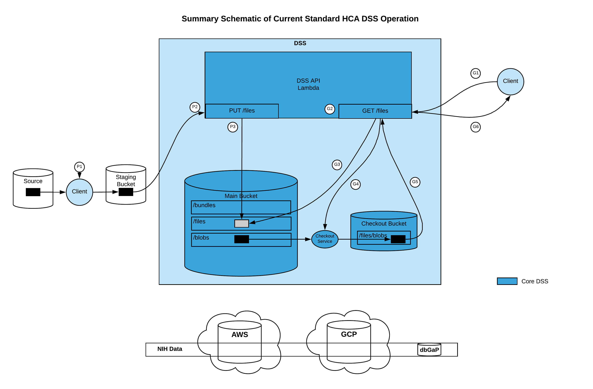
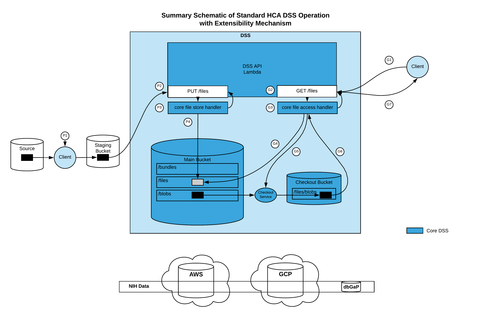
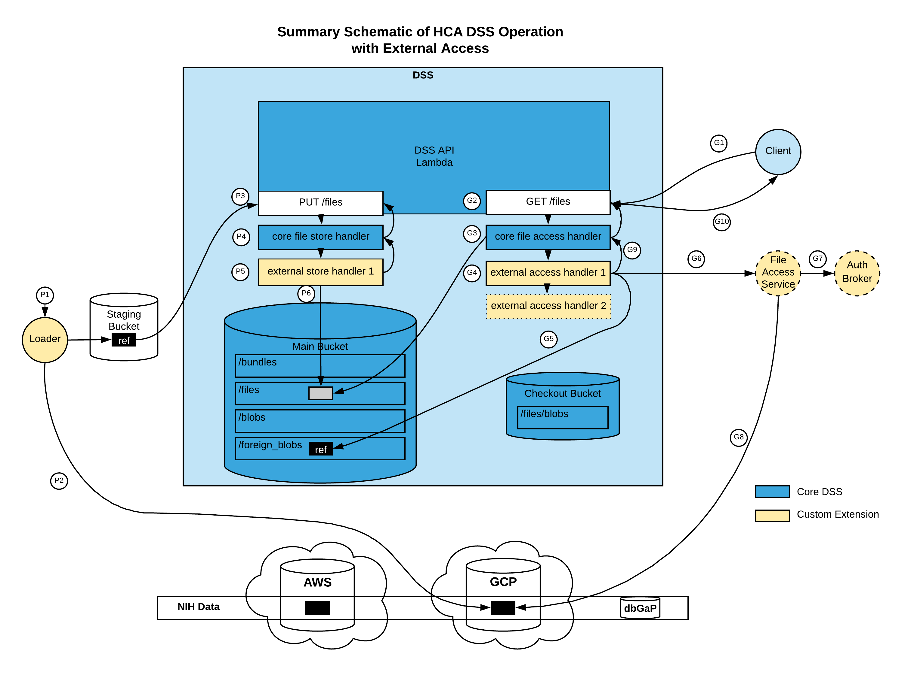

### DCP PR:

***Leave this blank until the RFC is approved** then the **Author(s)** must create a link between the assigned RFC number and this pull request in the format:*

`[dcp-community/rfc#](https://github.com/HumanCellAtlas/dcp-community/pull/<PR#>)`

# Extensible external file support

## Summary

This feature enables the HCA Data Storage System (DSS) to provide access to data files from across 
multiple external sources/projects, without the storage costs and other constraints of
copying the data into the DSS.

Access to data from multiple sources typically involves diverse access mechanisms and 
authentication/authorization protocols, and these are continuing to evolve.
This proposal defines an extensible mechanism enabling institutions with a DSS deployment to integrate 
external data sources, giving them full flexibility and responsibility for creating and maintaining these integrations.

This is done in a way that minimizes changes to the existing DSS code, entails minimal and 
backward compatible API changes, and adheres closely to the existing DSS design.
This change primarily pertains to the `PUT /files` and `GET /files` APIs.
In short, the proposed design makes these operations extensible using a plug-in mechanism and the 
[Chain of Responsibility](https://www.netobjectives.com/PatternRepository/index.php?title=TheChainOfResponsibilityPattern)
 pattern. The existing DSS code remains largely intact, aside from introduction of these extensibility mechanisms.

The feature request grew out of the UCSC Computational Genomics Platform team’s 
efforts to use the HCA DSS as the basis of a genomic data platform for the
[_NIH Data Commons Pilot_](https://commonfund.nih.gov/commons/)
and [_NHLBI Data STAGE_](https://www.nhlbidatastage.org/) programs.

The primary driver of this RFC is use of the HCA DSS for projects other than the HCA DCP
which require support for external files.
Yet, this feature may also be useful to the HCA if need arises to include controlled 
access data from external sources that could not be admitted into the DSS directly 
(e.g. due to geographic constraints on the storage location of the data, etc.)

## Author(s)

[Michael Baumann (UCSC)](mailto:mbaumann@ucsc.edu)
 
Additional contributors to the design:
* [Brian Hannafious (UCSC)](mailto:bhannafi@ucsc.edu)
* [Hannes Schmidt (UCSC)](mailto:hannes@ucsc.edu)
* [Trent Smith (UCSC)](mailto:tsmith12@ucsc.edu)


## Shepherd
***Leave this blank.** This role is assigned by DCP PM to guide the **Author(s)** through the RFC process.*

*Recommended format for Shepherds:*

 `[Name](mailto:username@example.com)`

## Motivation

Researchers benefit from being able to conveniently search across multiple projects/studies to find the data 
that best meets their research needs, then creating a _synthetic cohort_ for focused study and further analysis.
For publicly funded research projects especially, there is increasing emphasis on data that is 
[Findable, Accessible, Interoperable and Reusable (FAIR)](https://www.nature.com/articles/sdata201618).
The NIH and NHLBI are working towards providing a single set of their data (replicated across clouds) 
that is to be accessed from their existing locations, using the various access control mechanisms 
they provide -- and the files are not be copied. By accessing the data in-place, total storage costs are 
reduced and confidence that researchers are consistently accessing the correct data in increased.
 
The [University of Chicago's Gen3](https://ctds.uchicago.edu/gen3/) storage system 
([Indexd](https://github.com/uc-cdis/indexd)) already has this ability. 
This feature is of interest to multiple other institutions/projects as well.

### User Stories

#### User Story: Director's Needs
As the technical director(/PI/architect) of an institution’s genomic data platform, I want to setup a cloud-based 
data storage system that aggregates data produced by our organization with the genomic data from 
multiple other institutions, projects and studies. This is to enable researchers using our platform 
to select the best genomic data available for their research purposes from across many projects, 
creating _synthetic cohorts_ for subsequent analysis, etc.
The access mechanisms for these external data sources vary substantially from one another, 
including their authentication and authorization protocols and permissions.
For government funded projects, there is an emerging requirement that their data be accessed from 
the cloud location(s) they provide, and not be copied. The amount of data from these external projects is 
currently many hundreds of terabytes and growing rapidly. Accessing the external data in-place results in 
major cost savings and increases confidence that the correct data is being used.
Our team needs a cloud-based storage system with the flexibility to store data locally and integrate 
large amounts of external data into a cohesive whole for researchers using our system. 
We are mainly interested in storing references to the (typically large) data files available from external sources. 
The corresponding metadata from the various sources will be harmonized to facilitate researchers searching 
over the entire set of data, and we plan to store these transformed metadata files by copying them into our data store.
Currently the HCA DSS does not support integration of external data sources, so the DSS has not been a viable candidate 
for our needs. The addition of extensible external file access described in this RFC would enable our team to 
integrate access to these external projects. We expect to own and maintain the integration of these external sources,
yet would like to reuse existing high-quality, security compliant integrations for popular external sources,
if available.

#### User Story: DSS Administrator's Needs
As the administrator of our institution/project's DSS deployment, I need to configure access to the external
data sources identified by our director, so that our data wranglers and researchers will have a
rich set of data with which to work.

#### User Story: Data Wrangler's Needs
As a data wrangler, I want to "load" large numbers of data files from external sources so that our researchers
will have a rich set of data to work with conveniently. Given the multiple external data sources and 
the large number of files, the loading should be performed relatively quickly.
Moreover, if/when there is a change to the external source, whether for individual files or the source overall,
I need to be able to update the external access configuration to reestablish
external access, preferably without changes to the bundle/file uuids/versions in the DSS pertaining to the
affected files. 

We will have our own ETL data loading process, given the need to transform and harmonize the metadata from 
multiple projects and studies. This loader will use the HCA DSS Python bindings to load the data by either 
the standard internal copy process or as an external reference, as appropriate.

#### User Story: Researcher/End-User Needs
As a researcher (or other end-user) I want the DSS API/CLIs to work consistently
regardless of whether the data is stored internally in the DSS or is accessed from external sources.

#### User Story: Security/Compliance Officer's Needs
As the institution/project's security and compliance officer, I must know that both internal
and external data access is performed securely and upholds the security and compliance requirements
of both our own instition and those of the external data sources.

#### User Story: HCA DSS Developer's Needs
As a manager/developer of the HCA DSS for the HCA DCP, I must ensure the architectural integrity,
security, reliability, availability, performance, scalability, maintainability, etc. of the DSS
is upheld for the purposes of the HCA program. I would like the DSS to be used by other projects,
yet must be careful not to introduce any unnecessary risks that could impact the HCA program. 

## Detailed Design

### Schematic Overview of Operation
The following diagrams provide an overview of key aspects of the proposed changes.
* The first diagram shows the current/standard DSS operation for the relevant parts of the system
* The second diagram shows the same processing with the proposed extensibility mechanisms (only) introduced
* The third diagram shows the same processing for external files through the use of extensions

To help clearly communicate the key differences, some insignificant details of operation are omitted.

#### Current Standard HCA DSS Operation



This diagram shows the current, standard operation of the HCA DSS operation of `PUT /files` and `GET /files`.
This provides a baseline for subsequent diagrams showing the proposed changes.

**Steps**

**`PUT /files`**

* P1 - A client copies the file to be loaded from a source location (local system or cloud) to a staging bucket
and tags the file with the four required checksums derived from the file's content.
* P2 - The client invokes the DSS API `PUT /files` operation, passing the URL to the file in the staging bucket.
* P3 - The `PUT /files` operation creates manifest representing the file under `/files` and the contents of the file is
copied under `/blobs`, in the main DSS bucket.

**`GET /files`**
* G1 - A client requests a file from the DSS, passing the file identifier (UUID and, optionally, the version) and the
replica.
* G2, G3 & G4 - The `GET /files` operation is invoked, which accesses the file manifest then checks 
if the file blob is already available in the checkout bucket, and if not, 
invokes the checkout service to make it available there.
* G5 & G6 - The `GET /files` obtains a presigned URL for the file blob in the checkout bucket and returns it to the client.


#### Standard HCA DSS Operation with Extensibility Mechanism



This diagram shows the standard operation of the HCA DSS operation of `PUT /files` and `GET /files` after introduction
of the proposed extensibility mechanism. The code/processing is essentially unchanged from the current implementation,
aside from the introduction of the Chain of Responsibility pattern that is populated through a plug-in mechanism.

**Steps**

**`PUT /files`**

* P1 - A client copies the file to be loaded from a source location (local system or cloud) to a staging bucket
and tags the file with the four required checksums derived from the file's content.
* P2 - The client invokes the DSS API `PUT /files` operation, passing the URL to the file in the staging bucket.
The `PUT /files` operation passes the request to the chain of responsibility for storing a file.
* P3 - The first (and currently only) handler in the chain of responsibility identifies this as a DSS internal
file store operation which it will handle.
*P4 -  This handler executes essentially the same code as the current (unmodified) operation, which creates a manifest 
representing the file under `/files` and the contents of the file is copied under `/blobs`, in the main DSS bucket.

**`GET /files`**
* G1 - A client requests a file from the DSS, passing the file identifier (UUID and, optionally, the version) and the
replica.
* G2 - The `GET /files` operation passes the request to the chain of responsibility for accessing a file.
* G3 - The first (and currently only) handler in the chain of responsibility identifies this as a DSS internal file 
access operation which it will handle.
* G4 & G5 - This handler executes essentially the same code as the current (unmodified) operation,
which accesses the file manifest then checks 
if the file blob is already available in the checkout bucket, and if not, 
invokes the checkout service to make it available there.
* G6 - The handler obtains a presigned URL for the file blob in the checkout bucket and returns it to its caller.
* G7 - The presigned URL is returned to the client.

#### Standard HCA DSS Operation with External File Access




This diagram shows the operation of the HCA DSS operation of `PUT /files` and `GET /files` when storing a reference to, 
and accessing external data using proposed extensibility mechanism.

**Steps**

**`PUT /files`**

* P1 & P2 - A project's data loader obtains information about the external file to be loaded by reference, and creates 
an _external reference file_ in a staging bucket. This external reference file contains the information required by the
project's  _external reference handler_ to obtain a presigned URL to the external file. Under the current proposal, this
external reference file is tagged with checksums for the actual data file instead of those for the external reference file
per se.
* P3 - The loader calls the `PUT /files` with the new optional query parameter `storage_type=external`.
The `PUT /files` operation passes the request to the chain of responsibility for storing a file.
* P4 - The _core file store handler_ determines that it should not handle this request due to its storage type and 
passes the request down the chain of responsibility.
* P5 - The _external file store handler_ determines that it should handle this request.
* P6 - The _external file store handler_  creates a manifest  representing the file under `/files` 
that includes the new file manifest field `storage_type: "external"`
and the contents of the external reference file is copied under `/foreign_blobs`, using the checksums of the actual
external data file to compose the key. In addition, a timestamp-based version is appended to the key,
more about this later.

**`GET /files`**
* G1 - A client requests a file from the DSS, passing the file identifier (UUID and, optionally, the version) and the
replica.
* G2 - The `GET /files` operation passes the request to the chain of responsibility for accessing a file.
* G3 - The _core file access handler_ accesses the file manifest and 
determines that it should not handle the request due to the presence of the
`storage_type: external` field value and passes the request down the chain of responsibility.
As an optimization, it may pass the file manifest dict along with the request so that the next
handler in the chain does not need to retrieve it again.
* G4 & G5 - This _external access handler_ determines that it should handle the request based on the presence 
of the `storage_type: external` field value in the file manifest and, optionally, additional qualification based on 
the contents of the corresponding _foreign reference file_. If instead the handler determined that it could
not handle the request, it would pass the request to the next handler in the chain if there is one, or return an 
error indicating no handler was found for access to the external file.
* G6 - The _external access handler_ then uses the information in the _foreign reference file_ to obtain a
presigned URL for the external file. The _external access handler_ may be implemented to perform this inline,
or to make a request to a external file access service, depending on implementation considerations such as
the access protocol,  authentication/authorization requirements, etc.
* G7 - The file access service may use an authentication broker to exchange the user identity token passed in 
the DSS request for a user token of type required for accessing the external data, based on linked user accounts.
Note: The external access handler implementation may use a checkout mechanism/bucket or not.
Reasons for bypassing the checkout process may include 1) stipulation by the source provider that files are
to be accessed in place and not copied, and 2) security concerns of leaving restricted controlled access data
in the checkout bucket.
* G8 - The file access service requests a presigned URL for the external file from the external source,
using the appropriate type of user credentials, then returns the result to the _external access handler_.
* G9 - The presigned URL (or error response) is passed back up the chain of responsibility.
* G10 - The presigned URL (or error response) is returned to the client.


### Externally Visible Changes

#### DSS API Changes

This proposal includes the addition of an optional `storage_type` query parameter for the following
DSS API operations:

* `PUT /files/{uuid}`
Specifying the optional query parameter `storage_type=external` will cause the file to be
loaded as an external reference through use of an appropriate file store handler.

* `GET /files/{uuid}`
In general, `GET /files/{uuid}` will be called using the standard/existing DSS API parameters.
The proposed `GET /files/{uuid}` operation is designed to provide the same external behavior regardless of
whether the file is accessed from internal storage or accessed from an external source.
However, for administrative purposes, specifying the `storage_type=external` will return a
presigned URL to the external reference file, rather than to the contents of the external 
file per se. This may be useful for administrative diagnostic and maintenance purposes.

* `HEAD /files/{uuid}`
Include the storage type in the returned headers, e.g. `X-DSS-STORAGE-TYPE` with values `internal` or `external`.

* `GET /bundles/{uuid}` The result will appear largely as it does today, however, there are some differences
in the case where the bundle contains external files.
Performing `GET /bundles/{uuid}` with the 
options presignedurls or directurls will checkout the the internally stored files as usual.
For the presignedurls option, the resulting bundle manifest entry for an external file will 
include a presigned URL to the external source. For the directurls option, the resulting 
bundle manifest for an external file will contain a cloud URL if a meaningful/useful one 
is available from the external source, otherwise None.

#### DSS File Manifest Changes
This proposal includes the addition of a `storage_type` field to the DSS file manifest.
The proposed values are:
* `internal` (default) - the file is stored internally in the DSS (current/standard behavior)
* `external` - the file is external to the DSS and accessed accordingly

This could be a required field in the DSS file manifest, or to avoid file manifest 
migration, could be considered optional, with the default `"storage_type": "internal"`.

#### DSS Python Bindings and CLI

##### Python Bindings
The changes to the API described above apply in a straightforward way to the DSS Python bindings as well.

##### DSS CLI
The DSS CLI data consumer operations, including `download` will work transparently for both
internal and external files, without modification.

The DSS CLI data producer operations `put-file`
and `upload` are a different matter due to the preparation required to store an external file
(calculating the required checksums for the actual external data file, creating an appropriate
external reference file, tagging it appropriately, etc.). The primary use cases for this RFC
entail external files being stored in the DSS by data wranglers using a custom loading script
based on the DSS API or Python bindings. Therefore, use of the DSS CLI to store external files is
proposed as out of scope at this point, although support could potentially be added in the future.
Support for `put-files` would mainly entail user documentation of how to prepare to store
an external file in the DSS. Support for `upload` would require CLI code changes to identify
whether each file is to be loaded as internal or external, and to handle each appropriately.

### Internal Changes

#### Plug-in APIs
The proposed design has two plug-in interfaces, the first for the chain of responsibility for storing files,
the second for the chain of responsibility for accessing files. There need not be a one-to-one correspondence
between the handlers for file storing and file access, because a single, general external file storing handler can 
support a variety of external source/file types, each of which may be serviced by a specific external file access
handler.

##### File Store Plug-in API

The key methods in a file store handler are shown below as they would appear in an abstract base
class for the file store handlers:

```python
class FileStoreHandler(ABC):

    @abstractmethod
    def _should_handle(self, uuid: str, json_request_body: dict, version: str, storage_type: str = None):
        """
        Returns True if this handler should handle the given file, False otherwise.
        Information used to make this determination includes the `storage_type` parameter value, if present.
        If `storage_type="external", optional additional qualification may be
        based on contents of the external reference file being stored.
        """
        raise NotImplementedError()

    @abstractmethod
    def put_file(self, uuid: str, json_request_body: dict, version: str, storage_type: str = None):
        """
        Implements the full `PUT /files/{uuid}` operation, if this handler should handle the given file.
        Returns a response object.
        """
        raise NotImplementedError()
```

##### File Access Plug-in API

The key methods in a file access handler are shown below as they would appear in an abstract base
class for the file access handlers:

```python
class FileAccessHandler(ABC):

    @abstractmethod
    def _should_handle(self, uuid: str, replica: str, version: str = None):
        """
        Returns True if this handler should handle the given file, False otherwise.
        Information used to make this determination typically includes the
        content of the file manifest (including the `storage_type` field value).
        If `storage_type="external", optional additional qualification may be
        based on the content of the external reference file.
        """
        raise NotImplementedError()

    @abstractmethod
    def get_file(uuid: str, replica: str, version: str = None, token: str = None, storage_type: str = None):
        """
        Implements the full `GET /files/{uuid}` operation, if this handler should handle the given file.
        Returns a response object.
        """
        raise NotImplementedError()

    @abstractmethod
    def is_checkout_supported(uuid: str, replica: str, version: str = None):
        """
        Returns whether this handler supports/uses a checkout mechanism,
        if this handler should handle the given file.
        """
        raise NotImplementedError()

    @abstractmethod
    def generate_presigned_GET_url(uuid: str, replica: str, version: str = None):
        """
        Returns a presigned URL, if this handler should handle the given file.
        """
        raise NotImplementedError()

    @abstractmethod
    def get_direct_url(uuid: str, replica: str, version: str = None):
        """
        Returns a cloud direct URL suitable for use in a `GET /bundles/{uuid}` response when
        directurls=true if one is available, otherwise None,
        if this handler should handle the given file.
        """
        raise NotImplementedError()

    @abstractmethod
    def verify(uuid: str, replica: str, version: str = None):
        """
        Future/optional method to verify the availability and consistency/correctness of the file,
        if this handler should handle the given file.
        This could be used as part of an overall DSS integrity check in the future.
        """
        raise NotImplementedError()
```

##### File Access Plug-in Instantiation and Use

The plug-in based file store and file access chains of responsibility my be created and accessed
using new methods to the DSS `Config` class:

```python
    @staticmethod
    def get_file_store_handle(self):
        """
        Constructs the file store chain of responsibility from the configured plug-ins
        using a factory class and returns a handle to the top of the handler chain.
        This handle is cached and returned directly for subsequent calls.
        """

    @staticmethod
    def get_file_access_handle(self):
        """
        Constructs the file access chain of responsibility from the configured plug-ins
        using a factory class and returns a handle to the top of the handler chain.
        This handle is cached and returned directly for subsequent calls.
        """
```

#### External Reference

##### External Reference Management and Storage

The source(s) from which an external file is available can/does change over time.
For example, when working on the _NIH Data Commons_ and _NHLBI Data STAGE_ programs in 2018,
their DCC provided sequence files on one cloud platform many months before these same files
became available on another cloud platform. Therefore, it is important to be able to 
update the external reference file for a given external file as the file becomes available
on additional cloud platforms, or otherwise changes over time.

Data in the DSS is immutable by design, yet there is a simple approach that 
can be taken to support enable updates to the external reference files.
Briefly, the approach is as follows:

1. The blobs containing the external reference are stored with a different prefix (`/foreign_blobs`)
than are the standard file blobs.
2. The key for blobs is composed of the four standard checksum values (those of the actual external data file)
and an appended timestamp-based version.
3. When accessing the external reference blob, the most recent version is always used.

In this way, updates to foreign reference blobs can be synced between replicas without conflict,
and the latest available version will be used for external file access.

##### External Reference Content 
This proposal is intended to enable a wide variety of external data sources. It should allow virtually
any external source that can provide a presigned URL (in order to comply with the current DSS API) 
for a given file.

The types of information required for an external file reference/access may include:

* Identification of the external source (e.g. cloud provider, service endpoint, etc.)
* Identification of the specific external file, which may take many forms, for example:
    * Cloud URL
    * GA4GH DOS/DRS URI
    * SRA accession numbers (used with the NIH Sequence Data Delivery Prototype (SDDP), etc.)
    * DOIs, ARKs, Minids or other GUID formats
* Identification of the type of authentication/authorization credentials required,
and perhaps additional information.

Given the diversity of information required and the specific content, it seems appropriate to give
those developing external source integrations full flexibility regarding the content stored in the 
external reference file/blob. This also provides freedom to determine what is best provided in
the external reference, implemented in the corresponding file access handler plug-in,
or delegated to supplementary external services.

Although the format and content of the external reference file could be left completely open/free,
standardizing on the following, at least, seems reasonable/appropriate:
* JSON format
* Top-level structure is an array of objects
* Each object provides the information required to access the file from a specific source
* The associated/underlying cloud platform(s) of each source is identified in a standard way,
to enable selection of the most appropriate source to use for a given replica.

For example:

```text
[
  {
    "provider": "aws",
    ... additional fields as needed, determined developer of the external source integration ...
  },
  {
    "provider": "gcp",
    ... additional fields as needed, determined developer of the external source integration ...
  }
]

```

It is also recommended that those developing external access plug-ins create a shared dictionary
of names for commonly used fields, to prevent chaos over time. For example, these may include:
* `file_id_type`
* `file_id`
* `authentication_protocol`
*  etc.

#### Checkout Service
The behavior proposed is to not copy external files to the checkout bucket as is done for standard/internal files.
There is no current use case for external files requiring copy to the checkout bucket,
and there are good reasons not to do so, including 1) potential stipulation by the source provider
that files are to be accessed in place and not copied, and 2) security concerns of leaving restricted controlled
access data in the checkout bucket, especially when the external source has more stringent
controlled access reqirements than the DSS per se is using.

In general, DSS code that makes requests of the checkout service (e.g. `GET /files/{uuid}` and 
`GET /bundles/{uuid}` should only make requests for internal files. Small updates would be made 
to the checkout service to ensure it only performs checkout for internal files.

#### Sync Service
Overall, the standard sync service functionality will meet the needs of external file support.
Besides the change to the HCA blob store `compose_blob_key` function (below), a couple/few small isolated
changes may be entailed, which are not detailed here.

#### HCA Blob Store
The HCA blob store function `compose_blob_key` will be updated to take into account the `storage_type` identified
in the file manifest when composing the blob key, as the external reference representing the foreign blob
will be stored under the `/foreign_blobs` prefix, and the key will be versioned.
A few additional constants will also be added to `hcablobstore.py`

### Acceptance Criteria

#### Development

All approved changes described in this RFC are implemented and tested according to 
standard development practices.

#### System Testing

#### Functional Testing
Testing external file support will require a simple external access test plug-in.
A low-bar target could be loading and accessing a generally accessible files in an 
external cloud bucket, and is probably reasonable/acceptable for the purpose of this RFC per se.
A higher-bar target Loading and accessing a file in an external cloud bucket the the current user 
is not authorized to access, and would require the external access extension perform the 
access successfully.

##### DSS API
All DSS API operations directly pertaining to files or bundles (/files and /bundles endpoints),
with all relevant options, must be tested with both internal and external files.
Other DSS API endpoints (collections, search, subscriptions) should be unaffected by these changes.
All existing tests must continue to pass for internal files. 

##### DSS CLI
All CLI DSS subcommands for getting files and bundles, including `download` should be tested with
both internal and external files. The `put-file` and `upload` commands are
not (currently) supported for external files.

#### System Performance Test
Existing system performance tests should not find any statistically significant difference for internal files before
and after the changes described in this RFC are implemented.
Putting and getting an external file which is simply a reference to
another cloud location with little/no auth overhead (e.g. all implemented in the file access handle,
without the use of external services) should be similar to internal file access.

#### System Scale Test
Existing system scale tests should not find any statistically significant difference 
for internal files before and after the changes described in this RFC are implemented.

Assuming simple external file operations perform similar to internal file operations,
the scalability of external file access will primarily be constrained by custom/project-specific 
external file access mechanisms, and need not be tested as part of the changes for this RFC.

#### Documentation

##### API & CLI Documentation
The Swagger UI and CLI user documentation must reflect the additional options and
limitations noted in the Swagger DSS API specification.

##### How-to Guide for DSS External File Support
A "how to" guide/utorial for developing, configuring external access plug-ins and 
using DSS external file support should enable an experienced DSS devop/adminstrator
to perform these operations successfully.

### Unresolved Questions

- *What aspects of the design do you expect to clarify further through the RFC review process?*
- *What aspects of the design do you expect to clarify later during iterative development of this RFC?*

### Drawbacks and Limitations

#### "Bolt-on" Functionality
The change proposed "feels" like "bolt-on" functionality, which it is. The DSS API, system configuration
and use gives the distinct impression of external file support being add-on functionality.
Projects requiring a data store  with both internal and external file support may have 
a better experience with a different data store, one that has been designed with internal 
and external file support as equally important first-class functionality from the start.
That said, the proposed change should "work" in that it enables external file support.
For a project for which 
the DSS is a good fit overall (predominately internal storage, multi-cloud, etc) yet needs 
some amount of external file support, especially if for controlled access data, 
the proposed change could be useful.

#### Security Risk
Performing file access using the Chain of Responsibility pattern with handlers populated by a extensible plug-in 
mechanisms provides a potential point of attack through the the introduction of malicious code. Specifically,
because a file access handler that successfully obtains a presigned URL passes that result back up the chain of
responsibility, malicious handler code introduced higher in the chain to communicate that presigned URL to an
attackers system before passing the presigned URL further up the chain and continuing normal operation.
This risk could be mitigated by the following measures:
* Only using handlers with verified security compliance
* Robust mechanism for controlling which plug-ins are loaded
* Digitally signing the libraries containing the handlers and loading them accordingly

Ensuring that the core/standard DSS handlers (for internal storage) are always first in the chain of responsibility
would protect internal access from such attacks and support the performance of internal file access.

### Security

### External File Access Control
When access to an external file is controlled by the external source,
the access available to a given user is the intersection of 1) the access granted to the user by the HCA DSS auth system,
and 2) the access grated to the user by the external source for that file. Both constraints apply.

### Prior Art [optional]

*Share references to prior art to deepen community understanding of the RFC, such as learnings, adaptations from earlier designs, or community standards.*

### Alternatives

If a project requires internal and external file support, then a different data store (not HCA DSS)
that supports internal and external storage must be considered. One such candidate is 
University of Chicago's [Gen 3](https://ctds.uchicago.edu/gen3) system.


### Appendix: Epic and User Stories to Manage Development
The epic "Extensible external file support" can be organized into the following user stories to help manage the
development process. Approximate "T-shirt" sizes are provided.

* As a DSS developer, I want to change the existing PUT /files/{uuid} operation to use a plug-in mechanism to 
enable extensible external file storage (Large)
* As a DSS developer, I want to change the existing GET /files/{uuid} operation to use a plug-in mechanism to enable 
extensible external file access. (Medium)
* As a data wrangler, I want to put external files in the DSS, so that DSS includes content from external sources. (Medium)
* As a DSS data consumer, I want to get a file from the DSS that is from external source. (Medium)
* As a DSS data consumer, I want to get a bundle from the DSS that includes external files. (Medium)
* As a data wrangler, I want the HEAD /files/{uuid} response to indicate if a file is stored internally or externally so 
that my data management scripts can easily identify this. (Small)
* As a data wrangler, I want to update/change the content of the external reference stored in the DSS to that external 
files will continue to be accessed successfully. (Small - Medium)
* As a DSS developer, I want to know that external file support does not negatively impact the system functionality, 
performance, reliability, scalability or ease of use of the core/standard DSS system. (Medium)
