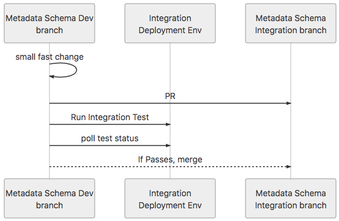
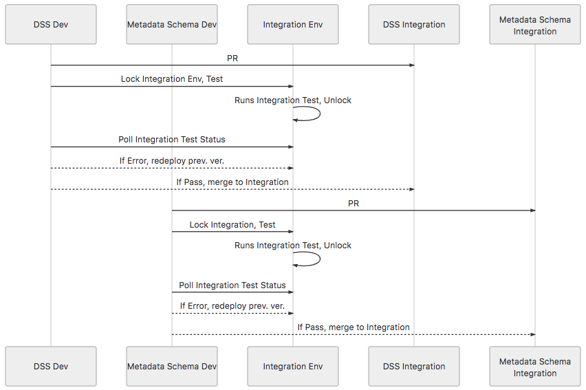

### DCP PR:

# Metadata integration testing

## Summary

This document details a integration test design for metadata schema changes in the Human Cell Atlas (HCA) Data Coordination Platform (DCP).

## Author(s)

* [Andrey Kislyuk](mailto:akislyuk@chanzuckerberg.com)
* [Sam Pierson](mailto:spierson@chanzuckerberg.com)
* [Matt Weiden](mailto:mweiden@chanzuckerberg.com)
* [Mark Diekhans](mailto:markd@ucsc.edu)
* [Hannes Schmidt](mailto:hannes@ucsc.edu)

## Shepherd

## Motivation

Currently breakages to DCP systems caused by metadata schema changes are detected at runtime upon data upload. This forces data wranglers, DCP operators, and data consumers to react to unpredictable runtime failures rather than detecting problems before the code is merged and deployed.

To alleviate this issue, the DCP development team can use an metadata schema integration test to test whether it is safe to release data downstream of the Data Storage Service (DSS), past which point applications start to depend on the schema. The benefits of this approach are that it will:

1. Make the development environment more stable
1. Make updates to software and schema smaller and more frequent
1. Make failures due to metadata schema changes more readily observable
1. Increase availability of DCP systems downstream of DSS

## Detailed Design

Software development proceeds in the dev branch of each component independently.
When a metadata schema version has passed unit tests in `dev` and its committers wish to promote it, they make a PR against their integration branch. The PR triggers a dcp-wide test in the integration environment.
Metadata schema changes can be merged from `dev` to `integration` only if the integration test suite passes.

Data with the new schema version should not be uploaded into the `integration` or subsequent deployment stages until the test passes and the `master` branch is promoted to `integration`.

#### Pros

* "Test then merge"
* PR status will not require wranglers to know about downstream systems
* Small non-breaking changes can be merged quickly and with confidence
* Greatly reduces probability of deployment stages past `dev` breaking

#### Cons

* May introduce another deployment stage
* Treats metadata schema integration differently from other DCP projects

## Alternative design

Software development proceeds in the dev branch of each component independently. Changes are merged into integration branch of each component only through PRs which cause system-wide integration tests to run. PRs are merged automatically if tests pass (but can be reverted if downstream breakage occurs). PRs must not be merged if tests do not pass.

*Here DSS Dev is shown as an example of other components following the same process.*

Data with the new schema version should not be uploaded into the `integration` or subsequent deployment stages until the test passes and the `master` branch is promoted to `integration`.

#### Pros

* "Test then merge"
* PR status will not require wranglers to know about downstream systems
* Small non-breaking changes can be merged quickly (out-of-order) and with confidence
* Greatly reduces probability of deployment stages past integration breaking
* More certainty for developers on behavior of the system
* Issues caused by metadata changes are surfaced early
* All DCP projects are integrated in the same way

#### Cons

* May be difficult to revert test versions of components and metadata (not all infra deployments are easily reversible)
* Requires "serializing" the dcp-wide integration test so that one PR can run after another

### Unresolved questions

* Will the metadata team be able to iterate on schema changes quickly enough with integration testing?
* Development plan for making DCP projects more robust to metadata schema changes
