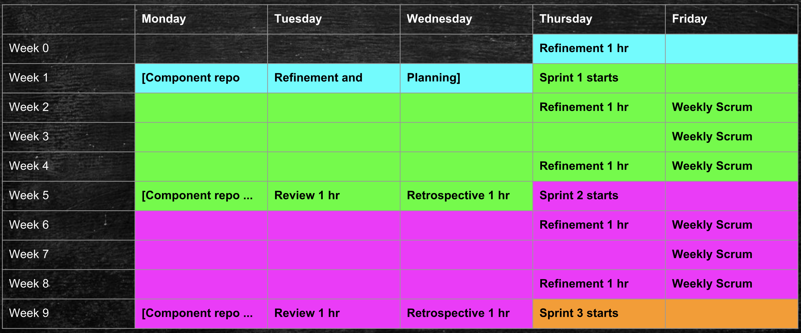

### DCP PR:

***Leave this blank until the RFC is approved** then the **Author(s)** must create a link between the assigned RFC number and this pull request in the format:*

`[dcp-community/rfc#](https://github.com/HumanCellAtlas/dcp-community/pull/<PR#>)`

# Planning for the DCP

## Summary

This RFC adopts and formalizes existing best project management practices and applications from the DCP community to define one process for planning and delivering product increments of the DCP *data as a service* on a regular cadence.

The key words "MUST", "MUST NOT", "REQUIRED", "SHALL", "SHALL NOT", "SHOULD", "SHOULD NOT", "RECOMMENDED", "NOT RECOMMENDED" "MAY", and "OPTIONAL" in this document are to be interpreted as described in BCP 14, [RFC2119](https://www.rfc-editor.org/rfc/rfc2119.txt), and [RFC8174](https://www.rfc-editor.org/rfc/rfc8174.txt) when, and only when, they appear in all capitals, as shown here.

## Author(s)

 [Trevor Heathorn](mailto:theathor@ucsc.edu)
 
 [Brian Raymor](mailto:brianraymor@chanzuckerberg.com)

## Shepherd

[TBD](mailto:username@example.com)

## Motivation

***[Note - remove if approved]***
*Early versions of this RFC were socialized with the DCP community during a PM call and at the DCP meeting in February 2019* 

One of the **challenges** facing the DCP as it matures was identified in this [Update from HCA Science Governance](https://docs.google.com/presentation/d/13hZ7vmr371mN1YFjFyDN-6c0Ul95NwiJcVsjA3nJFVE/edit#slide=id.p3):

> "A lack of reproducible planning process that prioritizes deliverables and ensures confidence that they will meet the needs of HCA"

### DCP _data as a service_

As a starting point, DCP should think *outside-the-box* and adopt one of the [principles of LeSS](https://less.works/less/principles/whole-product-focus.html) 
>"Customers don’t buy a part of the product, but the whole product … there is no value in separate parts or half-working parts."

Historically, ownership of the DCP software has been distributed across our canonical architectural diagram with its colorful *think-inside-the-boxes* (components). As a result, DCP planning and development have also been distributed to a high degree, resulting in questions or confusion about DCP priorities relative to component priorities with a subsequent lack of alignment for delivery of product increments, unless externally imposed by requests from HCA Science Governance. 

For example, how does a developer know whether to prioritize research for an operational scoping task assigned by the [**Architecture Team**](https://github.com/HumanCellAtlas/dcp-community/blob/master/charters/Architecture/charter.md), collaborate on a cross-component RFC surfaced at a DCP quarterly meeting, or develop a component-specific feature? 

To best serve our users and address the concerns of HCA Science Governance, our plans must focus on the needs and priorities of DCP *data as a service* rather than the individual *Chartreuse* or *Polka Dot* components. This requires a DCP-wide project management process with clear priorities and product increments delivered on a regular cadence. 

## Scientific "guardrails" 

As key stakeholders, the *Oversight Committee* MUST attend Sprint Reviews on a quarterly basis to offer feedback. 

## Detailed Design or _Scrum meets ZenHub_

### **!** Scrum

A single agile framework (referenced as **!** **Scrum**) MUST be used by all component teams for planning and developing DCP *data as a service* in an iterative, incremental manner.

Based on the broad adoption of Scrum variations across the DCP community, the expectation is that the reader is familiar with this framework and its artifacts. If not, please review the [definitive reference](https://scrumguides.org/docs/scrumguide/v2017/2017-Scrum-Guide-US.pdf) before proceeding.

Exceptions to Scrum (colloquially known as [ScrumButs](https://www.scrum.org/resources/what-scrumbut) in that community) are described below. 

As identified by [charters](https://github.com/HumanCellAtlas/dcp-community/tree/master/charters), the DCP **Product Owners** (with guidance from **UXR**) are the **!** **Scrum** Product Owners in violation of Scrum’s *"the product owner is one person, not a committee"*.

There is also no formal DCP **Scrum Master**.

### ZenHub

[ZenHub](https://www.zenhub.com/) has been partially adopted in the DCP community. This proposal commits the community to validating whether ZenHub can become our *one source of truth* for project management. If not, then it should be replaced with a more suitable alternative.

DCP SHOULD NOT duplicate the ZenHub DCP board in other documents or spreadsheets. The board and its reports represent the definitive list of DCP prioritized tasks (Product Backlog) and their state.

### ! Scrum → ZenHub Secret Decoder Ring

* Backlog items → Issues with User Stories
* Spikes → Issues with a "Spike" GitHub label
* Epics → Epics
* Sprint → Milestone
* Product Backlog → Issues without a Milestone in the *Product Backlog* pipeline
* Sprint Backlog → Issues with a Milestone in the *Sprint Backlog* pipeline

### DCP Product Backlog

The DCP ZenHub board is the ordered **!** **Scrum** Product Backlog for DCP. 

The top-level *dcp* repo MUST contain **all** significant features that are important to the DCP community as a whole and require visibility and prioritization. This includes  issues or epics describing user features or product-wide technical requirements (e.g. “components should have logs...“). 

All component repos that will assign items to a DCP Milestone MUST be added to the ZenHub *DCP Backlogs* workspace.

DCP Product Backlog items  are modeled as:
- [User Stories](http://agiledictionary.com/277/user-story/) with acceptance criteria
- [Epics](http://agiledictionary.com/309/epic/) contain a related set of smaller User Stories required to complete an objective.
- [Spikes](http://agiledictionary.com/209/spike/) adopted from eXtreme Programming to answer design questions.
  - [Example use in the Scaled Agile Framework](https://www.scaledagileframework.com/spikes/)

#### User Stories

The [*researcher with a keyboard*](https://docs.google.com/drawings/d/1Li9o_uVkEZDZHbkQv86I49FG8I0zGSgHYkKabp7piEs/edit) and [*researcher with a pipette*](https://docs.google.com/drawings/d/1o6I5BLtJuRJ1vUdb7dHCkFbo0XiaxKDBiVAogqnUowU/edit) journeys are the initial source of user stories that  are modeled as epics in the *dcp* repo,  reflecting the narrative flow of the product. Further refinement by the Product Owners is required to both develop and  extend the high-level set of user activities. 

Since journeys may vary per persona, personas MUST be identified for an epic by assigning a documented GitHub label such as "keyboard", "pipette", or "road-builder".  An epic MAY support multiple personas.

#### Technical and Operational Requirements
Product-wide technical or operational requirements are defined by the **Architecture Team** and modeled as epics in the *dcp* repo.

#### Owners

A DCP owner MUST be assigned to each issue or epic in the *Product Backlog* in the *dcp* repo to shepherd and coordinate progress. This owner is responsible for ensuring that related issues are created in component repo(s) and linked to epics in the *dcp* repo.

For example, an implementation task for a specific component resides in its own ZenHub repo and is linked to the relevant epic in the *dcp* repo.

* No component-specific GitHub labels such as "Data Store" MUST be assigned to an epic in the *dcp* repo. The link documents the relationship.

### Sprints

 **Four week sprints**. There MUST be one DCP Sprint and Sprint Backlog, not a separate Sprint and Sprint Backlog for each component team. Each DCP Sprint starts on Thursday and ends on Wednesday.  
 
Each Sprint MUST be assigned a ZenHub *Milestone* with a due date by the **Product Owners**.

 All Scrum events are scheduled on the DCP calendar at a regular cadence. For example:

### Refinement

New items appear in the ZenHub *New* pipeline and must be triaged into the *Product Backlog* pipeline, the *Icebox* pipeline, or the *Closed* pipeline.

**NOTE**: *To avoid maintenance overhead due to duplicate or incomplete issues, the creation of new items SHOULD be limited to [**DCP PM**](https://github.com/HumanCellAtlas/dcp-community/blob/master/charters/PM/charter.md) or a facilitator from the **Architecture Team**.*

The ZenHub *Product Backlog* pipeline is the DCP product backlog which is ordered during Refinement.

The ZenHub *Icebox* pipeline SHOULD be used with great constraint in the *dcp* repo. It's not a pipeline for avoiding hard decisions during Refinement. It's intended to document potential *futures* from the DCP roadmap. Individual component repo(s) MAY use the *Icebox* pipeline in a manner of their own choosing.

***QUESTION**: During the PM whiteboard session, there was agreement that dcp Epics would follow the normal pipeline lifecycle. Is this still true?*

No issues in the *dcp* repo MUST be assigned to the *Epic* pipeline. It will also be hidden in the dashboard. Individual component repo(s) MAY use the *Epic* pipeline in a manner of their own choosing.

**Every two weeks**. There is a one hour meeting for **Product Owners**, **UXR**, and **Technical Leads** to collaborate on refining the *dcp* repo *Product Backlog* to reflect DCP priorities and address emerging issues. (Refinement may also occur during the Sprint Review)

Questions or disagreements about priorities MUST be referred to the **Project Leads** on the [DCP PM mailing list](pm-team@data.humancellatlas.org) for resolution. They may resolve it in a manner of their own choosing, and respond to the original message on the DCP PM mailing list within two business days.

***NOTE**: DCP roadmaps will be a source for a shared understanding of DCP priorities in the future.*

After this meeting, the **Product Owner** and **Technical Lead** for each component MUST ensure that the *Product Backlog* in their repo is refined and aligned to the DCP priorities.

### Sprint Planning

Prior to the start of the DCP Sprint, component teams identify their *Sprint Backlog* - a slice of items from the the ZenHub *Product Backlog* pipeline in their repo which are assigned to the ZenHub Milestone for the Sprint and moved to the ZenHub *Sprint Backlog* pipeline.

The number of items selected is solely up to the Development Team. 
- [ZenHub story points](https://help.zenhub.com/support/solutions/articles/43000034282) MUST be assigned to all *Sprint Backlog* items. (Story points are required to enable [ZenHub burndown charts](https://help.zenhub.com/support/solutions/articles/43000010356-track-sprint-progress-with-burndown-charts) to track the progress of a Sprint.)
  - [How to start?](https://www.scrum.org/forum/scrum-forum/6774/how-decide-how-many-story-points-take-first-sprint)
- Research and prototyping tasks SHOULD be modeled as Spikes.
- Dependencies between components within a Sprint MUST be communicated between the respective teams and surfaced using [ZenHub Dependencies](https://help.zenhub.com/support/solutions/articles/43000010349). 

At the start of the Sprint, the single DCP Sprint Backlog can be reviewed by **PM** and the **Architecture Team** in their oversight roles.

### Sprint(ing)

During Development, individual developers assign items from the ZenHub *Sprint Backlog* pipeline and move to the *In Progress* pipeline. 

When there is a pull request in review for an *In Progress* item, the item is moved to the *QA/Review* pipeline. 

If rejected, the item returns to *In Progress*; otherwise, it is deployed in Dev for verification and moves to *Done* pipeline.

Items that are *Done* are moved to the *Closed* pipeline when verified in Dev or Integration. 

During Sprints, the **Architecture Team** MAY schedule Scrums on a regular cadence for the DCP Development Team *"to identify if any integration issues exist."* (See *Daily Scrum* in [**Scrum Nexus**](http://scrumorg-website-prod.s3.amazonaws.com/drupal/2018-01/2018-Nexus-Guide-English_0.pdf) for guidance)

**PM** monitors progress using ZenHub charts and reports.

### Sprint Review

**Every four weeks**. On the penultimate day of the Sprint, there is a one hour meeting for the Sprint Review open to the entire DCP commmunity led by **PM**. Major product increments selected by **Technical Leads** are demonstrated to key stakeholders.

(See *Sprint Review* in [*Scrum Guide*](https://scrumguides.org/docs/scrumguide/v2017/2017-Scrum-Guide-US.pdf) and *Nexus Sprint Review* in [*Nexus Guide*](http://scrumorg-website-prod.s3.amazonaws.com/drupal/2018-01/2018-Nexus-Guide-English_0.pdf) for additional details.)
 
### Sprint Retrospective

**Every four weeks**. On the final day of the Sprint, there is a one hour meeting for the Sprint Retrospective open to the entire DCP commmunity led by **PM**.
 
The Scrum Retrospective identifies opportunities to improve the planning process in future iterations. 

(See *Sprint Retrospective* in [*Scrum Guide*](https://scrumguides.org/docs/scrumguide/v2017/2017-Scrum-Guide-US.pdf) and *Nexus Sprint Retrospective* in [*Nexus Guide*](http://scrumorg-website-prod.s3.amazonaws.com/drupal/2018-01/2018-Nexus-Guide-English_0.pdf) for additional details.)

### Acceptance Criteria

This process will be under continuous community introspection and improvement through the Sprint Retrospective. If the process fails to deliver product increments with high confidence after three Sprints, then more radical alternatives should be pursued that satisfy the requirements from our key stakeholders in HCA Science Governance.

### Unresolved Questions

This RFC proposes specific weekdays to start (Thursday) and end (Wednesday) Sprints, but we may need to use a doodle poll to reach consensus. Monday is best avoided due to the number of holidays. 

#### Requested Guidance from the Architecture Team
- What is the recommended *interpretation* of story points for DCP developers? What does "1" mean? Consider [Engineering Estimates](https://producthabits.com/engineering-estimates/) as an example.

- Once existing technical debt epics are addressed, how should operational requirements  be defined and then modeled in ZenHub for new stories (for example as standard Acceptance Criteria)?

- During Sprint(ing), is there a position on the preferred style (meeting agendas, slack) and cadence of Scrums of Scrums for developers?

### Drawbacks and Limitations

Adoption of a shared DCP community practice in preference to institutional practice requires compromise and adaptation which can be challenging.

Geographical distribution constrains available meeting time for Scrum events.

### Prior Art

There are many *Scrum @ Scale* and *Agile @ Scale* variations:
* [Nexus](http://scrumorg-website-prod.s3.amazonaws.com/drupal/2018-01/2018-Nexus-Guide-English_0.pdf): The Definitive Guide to scaling Scrum
* [LeSS](https://less.works/) (Large-Scale Scrum) framework for scaling Scrum

### Alternatives

There are many potential methodologies and alternatives for project management. This RFC avoids radical departures from current community practice.
