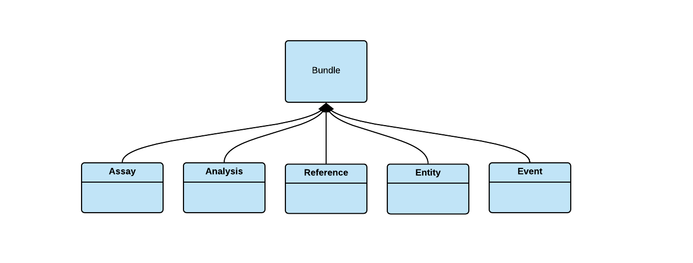

### DCP PR:

***Leave this blank until the RFC is approved** then the **Author(s)** must create a link between the assigned RFC number and this pull request in the format:*

`[dcp-community/rfc#](https://github.com/HumanCellAtlas/dcp-community/pull/<PR#>)`

# Application Layer Bundle Types and Definitions


## Summary

This RFC is offered as a refinement and generization of the [RFC: HCA DCP Bundle Types and Definitions]( https://github.com/HumanCellAtlas/dcp-community/pull/93). 

This RFC describes:

1. An application/metadata level mechanism to define bundle types and a simple bundle type hierarchy.

1. An application/metadata method level to specify the type of a bundle.
 
1. Several bundle types designed to match current usage and near term expected usage. 

### Key Differences from RFC: HCA DCP Bundle Types and Definitions

This proposal differs from [RFC: HCA DCP Bundle Types and Definitions](https://github.com/HumanCellAtlas/dcp-community/pull/93/files) mainly in that:

1. An application/metadata level mechanism to define bundle types and a simple Type information is added to a type.json  metadata file rather than added to the DSS bundle.json file.


1. Type information is expressed in JSON rather than of [RFC 7231](https://tools.ietf.org/html/rfc7231#section-3.1.1.1) media type syntax.


1. The schema and bundle types are represented as JSON schema in the metadata schema repo and documented on the Data Portal rather than maintained in a DSS registry.


## Author(s)

 [Dave Rogers](mailto:dave@clevercanary.com)

## Shepherd
***Leave this blank.** This role is assigned by DCP PM to guide the **Author(s)** through the RFC process.*

*Recommended format for Shepherds:*

 `[Name](mailto:username@example.com)`

## Motivation

When dealing with schemaless data stores such as DSS, the responsibility for establishing the data schema and ensuring data validity becomes the responsibility of client applications writing data into the data store.

If the application does not specify a way to define and implement types, it is possible for multiple “ad hoc” types or document shapes to evolve over time that are not well documented and are difficult to describe, validate, and query. 

To address this, this RFC:


1. Proposes a method of defining application level data types for DSS bundles.


1. Proposes a method of implementing application level data types for DSS bundles.


1. Proposes a simple type hierarchy for bundles that is closely tied to the application domain. 

As the proposed updates to the bundle schema are at the application/metadata layer rather than the DSS/storage layer, no changes to DSS are envisioned, except for perhaps defining a new HCA file type and adding its contents to its index

### DSS Basics
While the DSS is generally schemaless it does define two record types: files and bundles. 

While the DSS is generally domain model agnostic, a schema exists for files that allows the distinguishing of data from metadata, and the determination of the domain model entity type represented by a metadata file.

A bundle is defined as a list of files, along with a creator ID, bundle ID, and bundle version. This makes the bundle a semanticless set of files with an ID and version. 

In practice, bundles are used to store the output of biological assays or analysis runs and their metadata although other uses are envisioned.

Clients of the DSS register queries with the DSS to subscribe to notifications of new bundles matching the query. The queries are over the existence and contents of the metadata files making for a kind of “Duck Typing” as there are no explicit defined types. 

### Rational for Bundle Types

#### Subscription queries can become complicated and brittle 
As the DSS is schemaless and there is no type system for bundles defined in the client application domain, subscription queries can become complicated as they must define selection criteria adequate to tell one assay or analysis type from another by looking at domain object properties only.   

Additionally, there are on the horizon, requests to create bundles that specify lifecycle events of domain objects or groups of bundles (e.g. DAPS bundle) and to store reference data used by analyses, or the full metadata graph of a project for example. Care must be taken that any new bundle types do not accidentally match existing queries.

#### Metadata is coupled to the storage system bundle manifest
Metadata files are not fully interepretable outside of the context of a bundle. Metadata files contain no links to other files. Instead links are represented in a links.json file which is part of the metadata standard and contained in the same bundle as the metadata files.

The IDs in the links.json file however are not fully qualified. To fully resolve a link, the FQID of the metadata file must be looked up in the DSS bundles.json.

No attempt is made here to address metadata/bundle.json coupling however we would like to avoid further coupling such as adding type information to the bundle.json manifest by keeping the type information separate from the manifest and in the metadata instead.

#### Bundle  process and protocol information is represented differently in ingest vs. analysis bundles
Information about the process and protocols used to create a file are in different places in the current ad hoc ingest and secondary analysis bundles increasing the difficulty of determining the bundle origin across the ad hoc bundle types. 

Ingest bundles specify a process_0.json file to indicate the process and a “sequencing_protocol_0.json file to indicate the sequencing protocol. 

Analysis bundles use an analysis_process0.json and analysis_protocol_0.json. Additionally because of copy forward, the process_0.json and sequencing_protocol_0.json also exist in the analysis bundles. 

#### The bundle concept is not well understood by stakeholders
One additional (and original) motivator for this RFC is that many DCP members, developers, data contributors and data consumers have trouble relating to the concept of a bundle. There are several factors that contribute to this:

1. For developers and DCP members, the difficulty may stem from the fact that we do not have an official shared vocabulary for referring to the entity type represented by the bundle. 


1. Data contributors and consumers expect that their domain conceptual model maps rather directly to what they see in the DCP. Users want to search, download, and reference projects, assays, and analyses. They want the results of sequencing runs, alignment files, and expression counts. Storage level concepts such as the bundle and bundle.json are unexpected.


1. Bundle shapes vary widely by library construction approaches. For example a Smart Seq 2 ingest bundle contains a single cell, while a 10x V2 bundle may contain data for hundreds of cells. The fact that the ingest bundling size leaks all the way to the system output further complicates bundle comprehension. 


1. Bundle are not well documented and are not self documenting. 


In short additional assays and analyses as well as demands of representing domain entity state are making it apparent that a schema for bundles will help:

1. Provide a common language for discussing the DCP processing model and its data types.


1. Simplify subscription queries and make them less brittle with respect to new data types being added to the system.


1. Make it easier to identify the contents of a bundle, when a bundle is inspected out of the context of a query result set. 


1. Enable new functionality once new bundle types are implemented. 


### User Stories

Distilling the motivation above into a few use cases yields:

1. As a DCP Developer or Tool Builder, I would like to simplify and reduce the brittleness of the queries required to find assays or analysees.


1. As a DCP Developer, I would like to use DSS to store bundles with new meanings/shapes to serve new use cases as they are discovered without worrying about breaking existing queries.


1. As a DCP Developer, I would like to have a common language, closely related to the application domain to discuss bundle types.


1. As a Data Consumer, I would like to work in the natural model of the domain without having to learn data storage system related concepts.


1. As a Data Consumer, I would like to be able to tell the type of a bundle by inspecting the domain metadata contents rather than examining storage system metadata. 


1. As a Data Consumer, I would like key type parameters to be more explicit in the metadata so they can be discovered by inspection. 


1. As a Developer or Data Consumer, I would like clear documentation enumerating bundle types explaining their shape and purpose.


## Scientific "guardrails" [optional]

*Describe recommended or mandated review from HCA Science governance to ensure that the RFC addresses the needs of the scientific community.*

## Detailed Design

### Overview

To address the above motivation, it is proposed to:

1. Create an extensible type system with five main types: _Assay_, _Analysis_, _Reference_, _Entity_ and _Event_.


1. Allow for one level of subtyping to refine the types.


1. Further refine the type by referencing the process and protocol, used to create the bundle and other type specific information as required.


1. Add a type.json file to each bundle to specify the bundle type information.


1. Specify the desired types in JSON schema.


1. Document bundle types and shapes in the data portal.

### Core Types



#### Assay Bundle

Umbrella type for Assays/Measurements with the following subclasses:


1. “Sequencing Assay” - representing the current sequencing ingest bundles.

1. “Imaging Assay” - representing the current imaging ingest bundles. 

1. Other high level assay types.


> _Note: It may take some discussion to decide on an effective set of subclasses. Sequencing assay may need to change to “2nd Gen Sequencing Assay” or “NGS Sequencing Assay” for example._

#### Analysis Bundle
Umbrella type used to represent an analysis with the following possible subclasses:


1. “Alignment-Expression” - representing our current secondary analysis pipelines.


1. “Expression Matrix” - a possible subtype representing the expression matrix generation.


1. “Expression Normalization” - a possible subtype representing the expression matrix normalization output for example.


1. “Clustering” - a possible subtype representing cell clustering analyses output for example.

> _Note: The exact names of the subclasses above can likely be improved upon. Please suggest._

#### Reference Bundle
Umbrella type representing a reference file used in analysis. Subclasses TBD.

#### Entity Bundle
A container to hold an explicit view of all of the metadata associated with a given domain object such as project or donor. Possible subclasses:


1. Project  - currently one must iterate over all bundles in a project to build the full project graph. For example, a “Project Entity” bundle could hold the entire metadata graph for a project version in both json and tsv formats.


1. Donor - similarly, a donor entity bundle could hold the entire metadata graph for a given donor in multiple formats.


#### Event Bundle 

Representing state change of a set of bundles relating to a domain entity or an arbitrary set of bundles. This could be used for example to implement a “data group” indicating that all of the Assay Bundles corresponding to a specific library prep instance have been ingested and secondary analysis on this “version complete” data set can commence. 

### Example JSON Files

#### Assay Bundle

```
{
 "describedBy": "https://schema.humancellatlas.org/tbd/assay/6.0.0/assay_bundle"
 "type": "assay",
 "sub_type": "sequencing",
 "source": {
   "process": {
     "process_id": "process_id_2490",
     "document_id": "acc0c18d-fb97-4b80-b935-6576bfba51be"
   },
   "protocol": {
     "protocol_id": "sequencing_protocol_1",
     "protcol_name": "SmartSeq2 single cell sequencing",
     "document_id": "eb61d563-e7ec-407d-a84f-3626663eb4fa"
   },
   "provenance": {
     "document_id": "33f2f15d-f734-41a6-9987-40df632c5e61",
     "submission_date": "2019-05-10T14:22:49.325Z"
   }
 }
}
```
_type_ - indicates the top level type, will always be “assay” for Assay Bundles.


_sub_type_ - indicates the subclass or category of the “Assay Bundle”.


_source_ - refines the subtype by indicating the process and protocol used to create this bundle while making the source explicit and uniformly accessed over bundle types.

#### Analysis Bundle

```
{
 "describedBy": "https://schema.humancellatlas.org/tbd/analysis/6.0.0/analysis_bundle"
 "type": "analysis",
 "sub_type": "alignment-expression",
 "source": {
   "process": {
     "process_id": "4ca3e9fd-2283-4464-924c-5919ebf3cf8c",
     "document_id": "89408a3d-eb4c-4dd2-8acf-e64a9d910c57"
   },
   "protocol": {
     "protocol_id": "smartseq2_v2.3.0",
     "protcol_name": "",
     "document_id": "03c3a2dc-6f80-4acb-a2df-0dd411580244"
   }
 },
  "provenance": {
     "document_id": "33f2f15d-f734-41a6-9987-40df632c5e61",
     "submission_date": "2019-05-10T14:22:49.325Z"
    }
}
```

_type_ - indicates the top level type, will always be “analysis” for analysis bundles.


_sub_type_ - indicates the subclass or category of the analysis bundle.


_source_ - indicates the process and protocol used to create this bundle again refining the subtype while making the source explicit and uniformly accessed over bundle types.


#### Reference  Bundle

```
{
 "describedBy": "https://schema.humancellatlas.org/tbd/reference/6.0.0/reference_bundle"
 "type": "reference",
 "sub_type": "TODO " ,
 "provenance": {
     "document_id": "33f2f15d-f734-41a6-9987-40df632c5e61",
     "submission_date": "2019-05-10T14:22:49.325Z"
   }
}
```

_type_ - indicates the top level type, will always be “reference” for reference bundles.


_sub_type_ - indicates the subclass or category of the reference bundle.

Note: This section needs refinement/detail to list out current and expected reference file types and understand how this bundle would be queried.


The reference bundle also contains the uploaded reference files and the normal bundle.json. 

#### Entity Bundle

```
{
 "describedBy": "https://schema.humancellatlas.org/tbd/entity/6.0.0/entity_bundle"
 "type": "entity",
 "sub_type": "project" 
 "entity_id": "cddab57b-6868-4be4-806f-395ed9dd635b"
 "entity version" : "2019-05-10T142452.095000Z"
 "provenance": {
      "document_id": "33f2f15d-f734-41a6-9987-40df632c5e61",
      "submission_date": "2019-05-10T14:22:49.325Z"
    }
}
```

_type_ - indicates the top level type, will always be “entity” for entity bundles.


_sub_type_ - indicates the subclass or category of the entity  bundle e.g. “project” for a project entity bundle, “donor” for a donor entity bundle.

_entity_id_ - indicates the UUID of the file representing the metadata for the entity. 

_entity_version_ - indicates the version of the file representing the metadata for entity.

The entity bundle also contains the full metadata graph related to the specified entity. 


#### Event Bundle

The event bundle type is inspired by new bundle type requested by the “Processing Datasets that Span Multiple Data Collection Runs” RFC https://github.com/HumanCellAtlas/dcp-community/pull/88 to handle the proposed data_groups. 

```
{
 "describedBy": "https://schema.humancellatlas.org/tbd/event/6.0.0/event_bundle"
 "type": "event",
 "sub_type": "ingest-version-complete" ,
 "subject_entity_type": "library prep" ,
 “subject_entity_id”: “cddab57b-6868-4be4-806f-395ed9dd635b”
 “subject_entity version” : "2019-05-10T142452.095000Z",
 “fqids”: [
    “1ddab57b-6868-4be4-806f-395ed9dd635b:2019-05-10T142452.095000Z”,
    “2ddab57b-6868-4be4-806f-395ed9dd635b:2019-05-10T142452.096000Z”,
    “3ddab57b-6868-4be4-806f-395ed9dd635b:2019-05-10T142452.097000Z”,
    “4ddab57b-6868-4be4-806f-395ed9dd635b:2019-05-10T142452.098000Z”
 ],
 "provenance": {
    "document_id": "33f2f15d-f734-41a6-9987-40df632c5e61",
    "submission_date": "2019-05-10T14:22:49.325Z"
    }
}

TODO: Update to match how FQIDs are usually represented. 
TODO: Consider combining subject_id and version. 
TODO: Consider an option where the FQIDs are omitted and the recipient of this event queries for all bundles of their required type that are linked to the specified subject.
```
_type_ - indicates the top level type, will always be “event” for event bundles.


_sub_type_ - indicates the event type.

_subject_entity_type_ - indicates the schema_type of the entity whose state has changed.

_subject_entity_id_ - indicates the UUID of the entity described by the event.

_subject_entity_version_ - indicates the version of the file representing the metadata for entity.
 
 _fqids_ - array of the bundle FQIDs affected by this event. It is possible this could be ommitted and these bundles could be created by a query on bundles related to the subject with the relation specified by the sub_type.


### Summary

While this RFC proceeds in the same general direction as RFC 93 it:

1. Presents a more expressive, transparent and extensible type model using JSON and JSON schema rather than media type strings. 


1. Keeps types in the metadata and decoupled from the storage system implementation (out of the DSS bundle.json).


1. Documents the types in a more public and accessible manner e.g. Metadata Schema Repo and Data Portal vs DSS Registry


### Unresolved Questions

- What are the exact subclass names and definitions to be used?


### Drawbacks and Limitations [optional]

*Why should this RFC **not** be implemented?*

### Prior Art [optional]

*Share references to prior art to deepen community understanding of the RFC, such as learnings, adaptations from earlier designs, or community standards.*

### Alternatives [optional]

As mentioned this RFC is a refinement of RFC: HCA DCP Bundle Types and Definitions]( https://github.com/HumanCellAtlas/dcp-community/pull/93)

This RFC also references the "data_group" concept from [Processing Datasets that Span Multiple Data Collection Runs](https://github.com/HumanCellAtlas/dcp-community/pull/93)
