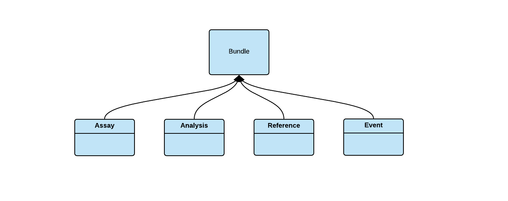

### DCP PR:

***Leave this blank until the RFC is approved** then the **Author(s)** must create a link between the assigned RFC number and this pull request in the format:*

`[dcp-community/rfc#](https://github.com/HumanCellAtlas/dcp-community/pull/<PR#>)`

# Domain Oriented Bundle Types and Definitions


## Summary

This RFC is offered as a refinement and generalization of the [RFC: HCA DCP Bundle Types and Definitions]( https://github.com/HumanCellAtlas/dcp-community/pull/93). 

This RFC describes:

1. A mechanism to define a bundle type schema.

1. A method to specify the type of a bundle.
 
1. Several bundle types designed to match current usage and support emerging requirements. 

### Key Differences from RFC: HCA DCP Bundle Types and Definitions

This proposal differs from [RFC: HCA DCP Bundle Types and Definitions](https://github.com/HumanCellAtlas/dcp-community/pull/93/files) mainly in that:


1. Type information is expressed in [JSON Schema](https://json-schema.org/) rather than of [RFC 7231](https://tools.ietf.org/html/rfc7231#section-3.1.1.1) media type syntax.

1. An attempt is made to harmonize bundle types and properties with existing entities and field value sets defined in the scientific data model schema.

1. The data_groups concept from [Processing Datasets that Span Multiple Data Collection Runs RFC](https://github.com/HumanCellAtlas/dcp-community/pull/88) is integrated and a corresponding bundle type is specified.

1. The bundle types schema is maintained new ```bundle_schema``` Github repository and documented on the Data Portal rather than maintained in a DSS registry.

1. The bundle.json created by the HCA CLI download is renamed to manifest.json so that a new bundle.json can be used as a "bundle_descriptor" specifying the type information as a nomral file in the bundle.  


### Revision History

1. Changed name to "Domain Oriented Bundle Types" - Thanks Mark D. for the suggestion.
1. Removed "Entity" bundle type as there currently no use case. (That I know of)
1. Removed explicit lifting of protocol id and process id from metadata into the type definition to avoid duplicating this information. Informing where the process/protocol information is for a bundle type can be handled by documentation. 
1. Removed type.json in preference for maintaining a bundle.json and manifest.json
1. Refined Event bundle definition to more closely align with RFC 88.
1. Overhaul of motivation section.


## Author(s)

 [Dave Rogers](mailto:dave@clevercanary.com)

## Shepherd
***Leave this blank.** This role is assigned by DCP PM to guide the **Author(s)** through the RFC process.*

*Recommended format for Shepherds:*

 `[Name](mailto:username@example.com)`

## Motivation

## Current "Duck Typing" for bundles will not scale with more bundle types

Currently several bundle types exist in the HCA DSS that can be discriminated from each other by inspection of the scientific metadata files contained in the bundle. 

Roughly,

1. Assay bundles do not contain an analysis.json file.
1. Analysis bundles contain an analysis.json file.
1. Reference Data Bundles contain neither file. (TODO is this correct?)

Over time it will become difficult to infer the type of the bundle by the shape of the metadata content. This "Duck Typing" will not scale easily to additional types.

## No schema makes data validation harder

With no schema language in place to specify the type and shape of a bundle, it's more difficult to write code to check that the data has the proper shape. This is of course important to support data validation before insertion and before and after migration and to validate the data already inserted. 

> This RFC does not specify to use JSON schema for the entire bundle contents, only the bundle type. However, by selecting JSON as a document format and JSON Schema as a schema language it puts us on a path to, in the future, schematize the entire bundle using the scientific metadata schema types as a starting point.

## To support emerging requirements, we will need to communicate lifecycle events of domain entities to DSS clients

It is envisioned  that project versioning, releases, live vs. complete vs. released views of data etc. will require us to communicate to DSS clients events such as:

1. When a project is created.
1. When all assay bundles are uploaded for a project version.
1. When secondary analysis is complete for all assay bundles in a project version.
1. When a matrix is available for a project version.
1. When additional data is added to a project.
1. When a new pipeline or pipeline version is added.
1. When a release is minted and what bundles are in it.
1. When a DOI is available for a release.

and so on..

## The bundle concept is difficult to communicate as it is not well defined
One additional (and original) motivator for the Bundle Types RFC is that many DCP members, developers, data contributors and data consumers have trouble relating to the concept of a bundle. There are several factors that may contribute to this:

1. For developers and DCP members, the difficulty may stem from the fact that we do not have an official shared vocabulary for referring to the entity type represented by the bundle. 

1. Data contributors and consumers expect that their domain conceptual model maps rather directly to what they see in the DCP. Users want to search, download, and reference projects, assays, and analyses. They want the results of sequencing runs, alignment files, and expression counts. 

1. Bundle shapes vary widely by library construction approaches. For example a Smart Seq 2 ingest bundle contains a single cell, while a 10x V2 bundle may contain data for hundreds of cells. The fact that the ingest bundling size leaks all the way to the system output further complicates bundle comprehension. 

1. Bundles are currently not well documented. 


In short additional assays and analyses as well as demands of representing domain entity state are making it apparent that a schema for bundles will help:

1. Provide a common language for discussing the DCP processing model and its data types.

1. Simplify subscription queries and make them less brittle with respect to new data types being added to the system.

1. Make it easier to identify the contents of a bundle, when a bundle is inspected out of the context of a query result set. 

1. Enable new functionality once new bundle types are implemented. 


### User Stories

Distilling the motivation above into a few use cases yields:

1. As a DCP Developer, I would like to simplify and reduce the brittleness of the queries required to find assays or analysees.


1. As a DCP Developer, I would like to use DSS to store bundles with new meanings/shapes to serve new use cases as they are discovered without worrying about breaking existing queries.


1. As a DCP Developer, I would like to have a common language, closely related to the application domain to discuss bundle types.


1. As a Data Consumer, I would like to work in the natural model of the domain without having to learn data storage system related concepts. 


1. As a Developer or Data Consumer, I would like clear documentation enumerating bundle types explaining their shape and purpose.


## Scientific "guardrails" [optional]

*Describe recommended or mandated review from HCA Science governance to ensure that the RFC addresses the needs of the scientific community.*

## Detailed Design

### Overview

To address the above motivation, it is proposed to:

1. Specify the desired types in JSON schema in a new "bundle_schema" repository.

1. Create an extensible type system with four main types: _Assay_, _Analysis_, _Reference_,  and _Event_. Other types, subtypes could of course be added as needed. A schemaless duck type could be added as well in a crunch but we would try to avoid doing that.

1. Allow for subtyping to refine the types.

1. Rename the current bundle.json to manifest.json and leave it otherwise untouched.

1. Add an updated bundle.json file to each bundle to specify the bundle type information.

1. Document bundle types and shapes in the data portal by referencing the schema.

### Core Types



#### Assay Bundle

Base type for Assays with the following subclasses:

1. “hca/ngs-sequencing” - representing the current sequencing ingest bundles.

1. “hca/imaging” - representing the current imaging ingest bundles. 

1. Other high level assay types.


> _Note: It may take some discussion to decide on an effective set of subclasses. Sequencing assay may need to change to “2nd Gen Sequencing Assay” or “NGS Sequencing Assay” for example._

#### Analysis Bundle
Base type used to represent an analysis with the following possible subtypes:


1. “hca/alignment-expression” - representing our current secondary analysis pipelines.

1. “hca/expression-matrix” - a possible subtype representing the expression matrix service output.

1. “hca/expression-normalization” - a possible subtype representing the expression matrix normalization output for example.

1. “hca/dimensionality-reduction" - a possible subtype representing TSNE plot type dimensionality reduction.

1. “hca/clustering” - a possible subtype representing cell clustering analyses output for example.

> _Note: The exact names of the subclasses above can likely be improved upon. Please suggest._


#### Event Bundle 

Representing state change  domain entity or an arbitrary set of bundles. This could be used for example to implement the “data group” indicating that all of the assay bundles corresponding to a specific project  have been ingested and secondary analysis on this “ingest version complete” project can commence. 

### Example JSON Files

#### Assay Bundle

```
{
 "describedBy": "https://bundle-schema.humancellatlas.org/tbd/assay/6.0.0/assay_bundle"
 "type": "assay",
 "sub_type": "hca/ngs-sequencing",
   "provenance": {
     "document_id": "33f2f15d-f734-41a6-9987-40df632c5e61",
     "submission_date": "2019-05-10T14:22:49.325Z"
   }
 }
}

```
- _type_ - indicates the top level type, will always be “assay” for Assay Bundles.

- _sub_type_ - indicates the subclass or category of the assay bundle.


We would document that the process and protocol that generated this schema are contained in a "process.json" and sequencing_protocol.json for this bundle type.


#### Analysis Bundle

```
{
 "describedBy": "https://schema.humancellatlas.org/tbd/analysis/6.0.0/analysis_bundle"
 "type": "analysis",
 "sub_type": "hca/alignment-expression",
  "provenance": {
     "document_id": "33f2f15d-f734-41a6-9987-40df632c5e61",
     "submission_date": "2019-05-10T14:22:49.325Z"
    }
}
```

- _type_ - indicates the top level type, will always be “analysis” for analysis bundles.

- _sub_type_ - indicates the subclass or category of the analysis bundle.

We would document that the process and protocol that generated this schema are contained in an "analysis_process.json" and an  analysis_protocol.json

#### Reference  Bundle

```
{
 "describedBy": "https://schema.humancellatlas.org/tbd/reference/6.0.0/reference_bundle"
 "type": "reference",
 "sub_type": "hg38" ,
 "provenance": {
     "document_id": "33f2f15d-f734-41a6-9987-40df632c5e61",
     "submission_date": "2019-05-10T14:22:49.325Z"
   }
}
```

- _type_ - indicates the top level type, will always be “reference” for reference bundles.

- _sub_type_ - indicates the subclass or category of the reference bundle.

> Note: This section needs refinement/detail to list out current and expected reference file types and understand how this bundle would be shaped and queried.


The reference bundle also contains the uploaded reference files and the normal manifest.json. 


#### Event Bundle

The event bundle type is a refinement of the new bundle type requested by the “Processing Datasets that Span Multiple Data Collection Runs” RFC https://github.com/HumanCellAtlas/dcp-community/pull/88 to handle the proposed data_groups. 

In the original RFC 88 the a "data_group" bundle is specified as:

> A new schema *data_group* will be created that contains the fields:
> - *scope* - Symbolic name of the scope, for example, *PROJECT_SCOPE*.
> - *step* - Symbolic name of the life-cycle step, for example *hca/primary-data; hca-data-type:sptx*.
> - *bundle_fqids* - List of FQIDs of bundles that are in the group.

In the update below:
 
 - *scope*  is replaced by *subject* that specifies the scope as an entity type and version. This makes the bundle an event about a lifecycle state transition of a specific identified entity.
 
 - *step* - is renamed "lifecycle_step" to make it more explicit that this is a lifecycle state transition. The field value is restricted to a lifecycle state transition for the subject entity type specified in the JSON schema or the bundle type. 
 
- *bundle_fqids* - is unchanged.

```
{
 "describedBy": "https://bundle-schema.humancellatlas.org/tbd/event/6.0.0/event_bundle"
 "type": "event",
 "lifecycle_step": "hca/project/primary-data-upload-complete", // allowed values specified in the schema
 "subject":{
    "schema_type": "project" // one of the schema types in the scientific data model.
    "provenance": {
             "document_id": "cddab57b-6868-4be4-806f-395ed9dd635a",
             "submission_date": "2019-05-10T14:20:25.934Z",
             "update_date": "2019-05-10T14:24:52.095Z"
         }
    }
 },
 “bundle_fqids”: [
    {"uuid":"1ddab57b-6868-4be4-806f-395ed9dd635b", "version": "2019-05-10T142452.096000Z"},
    {"uuid":"2ddab57b-6868-4be4-806f-395ed9dd635b", "version": "2019-05-10T142452.096000Z"},
    {"uuid":"3ddab57b-6868-4be4-806f-395ed9dd635b", "version": "2019-05-10T142452.096000Z"}
 ],
 "provenance": {
    "document_id": "33f2f15d-f734-41a6-9987-40df632c5e61",
    "submission_date": "2019-05-10T14:22:49.325Z"
    }
}

```
- _type_ - indicates the top level type, will always be “event” for event bundles.

- _lifecycle_step_ - indicates the lifecycle state that is changing. Allowed values would be restricted to those specified in the event's JSON schema. 

- _subject.schema_type_ - indicates the type of entity this event is about. Annalagous to "Scope" in RFC 88 but is linked to the scientific data model instead.

- _subject.provenance.document_id_ - indicates the UUID of the entity described by the event.

- _subject.provenance.submission_date_ - indicates the submission date of the entity described by the event.

- _subject.provenance.update_date_ - indicates the submission date of the entity described by the event.

 - _bundle_fqids_ - array of the bundle FQIDs affected by this event. It is possible this could be omitted and these bundles could be discovered by a query on bundles related to the subject with the relation implied by the lifecycle_step. 
  

>TODO: Review the above with Mark D to understand and resolve concerns about "The project does not identity the data".

>TODO: Resolve concerns about using the name "Event" here as it overloads the "event notification" termanology currently in use in the DCP. Make the distinction between a message passing style and the content of the message. 


### Summary

While this RFC proceeds in the same general direction as RFC 93 it:

1. Presents a more expressive and extensible type model using JSON and JSON schema rather than media type strings. 

1. Specifies types as normal bundle content and decoupled from the storage system implementation (out of the DSS CLI manifest.json, out of DSS bundle tags).

1. Refines the  "data_bundle" RFC 88 to link it to the scientific data model entities. 

1. Documents the types in a more public and accessible manner e.g. Bundle Schema Repo and Data Portal vs DSS Registry


### Unresolved Questions

- What are the exact subclass names and definitions to be used?


### Drawbacks and Limitations [optional]

*Why should this RFC **not** be implemented?*

### Prior Art [optional]

*Share references to prior art to deepen community understanding of the RFC, such as learnings, adaptations from earlier designs, or community standards.*

### Alternatives [optional]

As mentioned this RFC is a refinement of RFC: HCA DCP Bundle Types and Definitions]( https://github.com/HumanCellAtlas/dcp-community/pull/93)

This RFC also references the "data_group" concept from [Processing Datasets that Span Multiple Data Collection Runs](https://github.com/HumanCellAtlas/dcp-community/pull/88)
