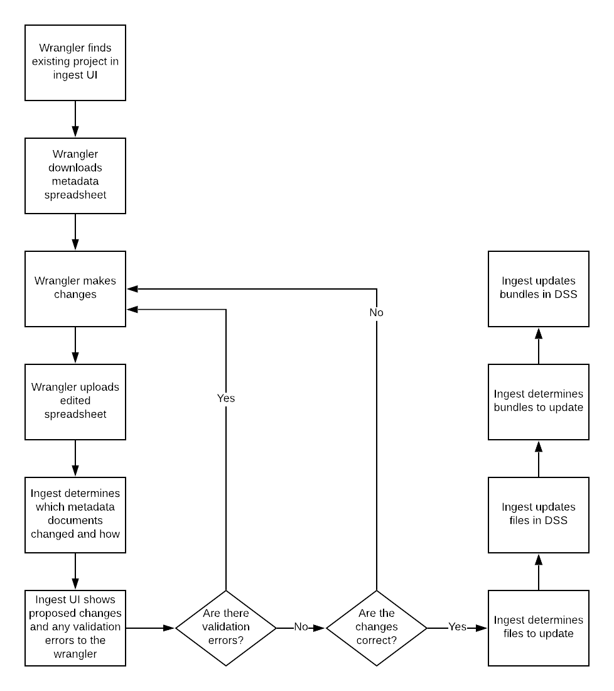
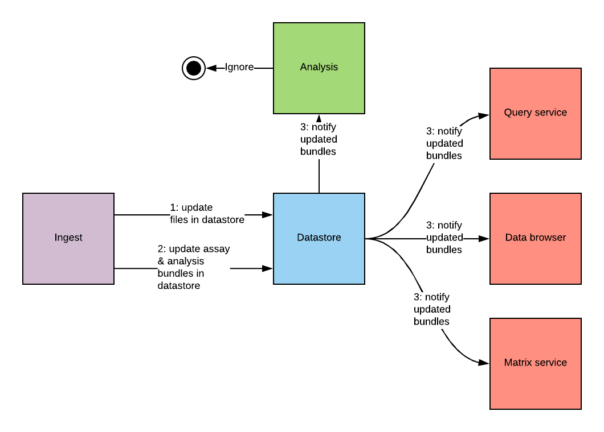

### DCP PR:

***Leave this blank until the RFC is approved** then the **Author(s)** must create a link between the assigned RFC number and this pull request in the format:*

`[dcp-community/rfc#](https://github.com/HumanCellAtlas/dcp-community/pull/<PR#>)`

# Simple Metadata Updates


## Summary

This RFC proposes the scope and design to allow simple metadata additions and updates to be collected by wranglers, reflected end-to-end in the DCP, and made available to consumer services such as the Data Browser and Matrix Service.


## Author(s)

[Laura Clarke](mailto:laura@ebi.ac.uk)  
[Justin Clark-Casey](mailto:justincc@ebi.ac.uk)  
[Mallory Freeberg](mailto:mfreeberg@ebi.ac.uk)  
[Norman Morrison](mailto:norman@ebi.ac.uk)

## Shepherd

_Leave this blank. This role is assigned by DCP PM to guide the Author(s) through the RFC process._

_Recommended format for Shepherds:_

```
[Name](mailto:username@example.com)
```  
## Motivation

Collecting data and metadata to submit to the HCA DCP is a time-consuming process which runs in parallel to conducting scientific experiments. This means that all of the data and metadata for a project might not be submitted at the same time. Additionally, as the HCA pushes for data to be submitted as soon as possible, to expedite its availability to the community, there is an increased risk of the project needing updates or new data and metadata being added.

For these reasons, the DCP must support additions, updates, deletions, and retractions of data and metadata in submitted projects including: adding a publication 1 year after a dataset was submitted, updating descriptive fields due to improvements in understanding and ontological modeling of anatomy or cellular identity, fixing metadata errors or relationships between entities, removing unconsented data.

This RFC proposes a simple technical design to support the simplest metadata updates and additions, recognizing that this is the first step towards a complete solution.

### Definitions

***Addition*** - adding a metadata field:value pair to a metadata document where the metadata field existed in the schema version described by the metadata document  
***Update*** - changing the value of an existing metadata field in a metadata document
***Old update process*** - the current update process which involves adding the existing project to an exclusion list and re-ingesting the entire project - with updates - from scratch as a new submission  
***Data wrangler*** - member of the DCP team who interacts with data contributors to collect metadata updates and additions and drives the process of submitting them to the DCP  
***Experimental design representation*** - the connected set of entities which the DCP uses to represent the experimental design of a project  
***Bundles*** - The data store representation of a logical set of data and metadata. There are two types of bundles input and analysis. Input bundles represent a single set of experimental data such as a lane or plex of sequencing and are defined by ingest as a biomaterial to file transition, connected by an assay process and all entities upwards in the experimental design from that point. Analysis bundles are all the analysis results from a single run of an analysis pipeline on a single input bundle and are defined by ingest as a file to file transition as defined by an analysis process and all entities upwards in the experimental design from that point.

## User Stories

As a data contributor, I would like to add the details of a scientific publication to my submission to the DCP to broaden knowledge of the work.

As a data contributor, I would like to correct an error I have made in my submission to ensure that the correct metadata is presented to consumers of my data.

As a data wrangler, I would like to update organ system metadata to reflect an improved ontology annotation for this particular organ.  

Read more on the general user experience background for this work: [User Experience Problem Space - Top task “Update my project”](https://docs.google.com/document/d/1FP6kJa3f9NkOHTLqmkNYztls7soZLgeGefxdgR81ONE/edit)

## Scientific "guardrails"

The proposed design has consequences for end users where different types of updates will have different impact on how data is visible in the DCP. Updates and additions which are in scope for this solution will have provenance trails which could be displayed to users. Other updates such as those which change the experimental design representation or require reanalysis will still use the old update process and won't have any provenance reflected inside the DCP. 

We propose the UX team work with the community and the DCP Oversight Committee, building on the existing research to understand our data consumers assumptions around updates and to guide how we display updates to consumers in the data browser and other consumer services both now and in the future.  

## Detailed Design

### User Interactions

These are the steps that a wrangler will follow to perform a primary metadata update.


[source](https://www.lucidchart.com/invitations/accept/67e4b9af-39ca-402c-a1b6-ebcd254174a7)

* **Step 1 - Wrangler finds submission**

The wrangler finds the project page in the ingest UI by searching over project names and descriptions. Ingest will provide the search capability.

The project page will list all the submissions for that project (at the moment all our projects have only one submission). They will navigate to this submission page.

* **Step 2 - Wrangler retrieves spreadsheet**

The wrangler will retrieve a spreadsheet for that submission by clicking a “Download metadata” button or similar on the submission page. The spreadsheet they receive will be the original spreadsheet they submitted plus a column at the end containing the UUIDs of all entities. This column exists only to allow ingest to identify how the rows in the spreadsheet relate to existing metadata when the updated spreadsheet is submitted. It should not be edited by wranglers.


* **Step 3 - Wrangler edits the spreadsheet with their change**

The wrangler edits the spreadsheet. They can change any metadata cell apart from the ones containing the UUIDs that ingest added. They can add and remove entries from tabs that contain array/module data. For this solution, they must not add or remove whole entities (e.g. biomaterials, protocols) or change the linking between entities. Both these are instances of experimental design representation changes and are out of scope.

* **Step 4 - Wrangler submits spreadsheet**

The wrangler will submit a spreadsheet containing an update through a “Submit update” button or similar on the submission page. For each submission, we will allow only one update to be submitted and processed at a time. For this solution, the wrangler can only submit an updated spreadsheet that validates against the current schemas. 

* **Step 5 - Ingest shows the diff to the wrangler for approval**

The wrangler will be shown the difference between their updates and the existing submission in the ingest UI. They will also be shown any validation errors. If there are no validation errors then they will have the option either to approve the update, in which case ingest will start submitting it to the datastore, or cancel it, in which case the update will be removed from ingest and they can return to step 3. If there are validation errors then the wrangler can only cancel the update and submit a new update spreadsheet.

* **Step 6 - Ingest uploads new versions of metadata files and bundles to the datastore**

For this solution, ingest will calculate the bundle updates and submit these to the datastore. This represents a risk to the scalability of this solution. If performance problems emerge we will need to consider solutions in a future RFC.

### API

The Ingest Service API provides a key capability for data wranglers to provide wrangling portals (interfaces) appropriate for their specific user or data modality needs, as well as for automation of bulk/batch data submission, data QC and status monitoring. The Ingest Service API also provides programmatic access for the analysis pipeline execution manager (however, metadata updates from analysis pipelines are beyond the scope of this RFC).

The Ingest Service API and its attendant developer resources (documentation and API client) will be updated to accommodate metadata update functionality as described in this RFC. The design of these API updates is beyond the scope of this RFC, and will be addressed in a future RFC.

### DCP Flow of Updates


[source](https://www.lucidchart.com/invitations/accept/67e4b9af-39ca-402c-a1b6-ebcd254174a7)

Once the bundles are updated (1 & 2), the datastore will send update notifications to all listeners (3). The query service, data browser and matrix service **MUST** all process these notifications to provide the updated metadata to consumers as required. The data processing pipeline execution service **MUST NOT** submit new or updated analyses to ingest for assays that have previously had analysis submitted. This solution requires the data processing pipeline execution service to capture and check if notification has already triggered a pipeline run and stop the run if it has.

For simple updates, ingest will update secondary bundles with primary data (copy forward) at the same time that it updates the primary bundles. It does not rely on a signal from the analysis component. This should change in future iterations of the update process.

### Acceptance Criteria

* A data consumer will have a consistent view of the most recent metadata associated with raw data and secondary analysis bundles presented in services like the data browser or matrix service.
* A data consumer will not receive duplicate analysis results due to an update.
* A data contributor can see the updated version reflected in downstream services which use that metadata field such as the data browser and the matrix service.
* The wranglers have documentation which allows them to determine if an update will trigger a new pipeline or the same pipeline with different parameters.
* The wranglers can access the spreadsheet for a particular submission via the ingest UI. The returned spreadsheet will contain all the relevant information to enable the ingest service to carry out the ingest and will use the schema of the original submission.
* The wranglers can see what documents in a submission have changed via an ingest UI view. 


### Unresolved Questions

This RFC does not represent a complete solution to the Addition and Update functionality that is needed by the DCP. There are a number of unresolved questions and missing functionality that will be left for future RFCs to address.

*   How is the provenance of data and metadata made clear to consumers?
*   How are data retracted without creating meaningless 404 errors for consumers who had used it? [RFC4: Deletion of Data in the DCP](https://github.com/HumanCellAtlas/dcp-community/blob/master/rfcs/text/0004-dss-deletion-process.md)considers some of this challenge.
*   How do we update files as opposed to metadata?
*   How do we make the update process through Ingest more straightforward?
*   What logic is needed to make decisions about rerunning data processing pipelines? Where should that logic live? Can that decision be automated?
*   How do we carry out updates which change our representation of the experimental design and change the number or types of entities which are available as part of a submission?
*   What is the interaction between metadata schema changes and updates?

### Drawbacks and Limitations 

There are many types of updates which are not supported by this solution including:

1. Updating to the experiment design representation, ie adding or removing protocols and biomaterials or identification of incorrect relationships between existing biomaterials, processes and files.
2. Updates which require additional or updated experimental data files
3. Updates which require an analysis pipeline to be run again, either a new pipeline or the same pipeline with different parameters
4. Migrating metadata to a new schema where this is necessary before a metadata update can occur. This is being considered independently of updates.
5. Removing experimental data files from a submission.
6. Redacting metadata (in the sense of completely purging it/hard deleting it from the system)
7. Redacting data (in the sense of completely purging it/hard deleting it from the system)
8. Updating metadata on unsubmitted datasets.

Implementing all of these features will take time, but the proposed design represents a step forward in the update and additional process and is valuable even if incomplete. Unlike the current update process, this design offers provenance for edits to bundles which can be presented to users; improving their experience of and trust in the platform.


### Prior Art

The update process has been discussed broadly by the DCP in the drafting process of this RFC and during F2F meetings.

Useful outputs from those discussions include:

[Use cases](https://docs.google.com/document/d/1rI8PCASomdAHznyWQceRJGv4-wtg-P5Rm-rI_uJLjtE/edit)

[Pre RFC](https://docs.google.com/document/d/1XeAw05RAJe20Q1XDF7eLWLGF3gCme4-8l-ZfhtDWOLg/edit?ts=5beda8b0)

[Ingest High-Level Design for Updates](https://docs.google.com/document/d/1XeAw05RAJe20Q1XDF7eLWLGF3gCme4-8l-ZfhtDWOLg/edit?ts=5beda8b0) 

[AUDR breakout session in the Feb 2019 F2F](https://docs.google.com/document/d/1LVRqeGqUjLaprLhojCLwL0PiVuv20f7B7W5S59GlBDM/edit)

[User Experience Problem Space - Top task “Update my project”](https://docs.google.com/document/d/1FP6kJa3f9NkOHTLqmkNYztls7soZLgeGefxdgR81ONE/)
