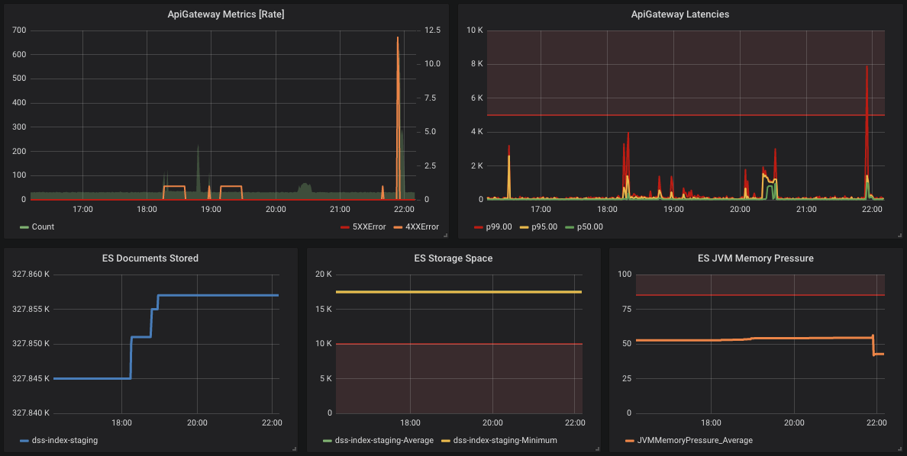

### DCP PR:

[dcp-community/rfc2](https://github.com/HumanCellAtlas/dcp-community/pull/53)

# Monitoring for production systems

## Summary

This RFC is the first standard for monitoring the production systems of the Human Cell Atlas (HCA) Data Coordination Platform (DCP). It describes the minimum viable monitoring infrastructure DCP production systems should have before serving user-facing features or supporting systems that do. We anticipate that future revisions of this standard will be needed to meet our Service Level Objectives (SLOs) as DCP matures.

The term monitoring is used here as defined in the [Google Site Reliability Engineering (SRE)](https://landing.google.com/sre/sre-book/chapters/monitoring-distributed-systems/) program. This document borrows heavily from SRE.

Key words to indicate requirement levels in this document follow [RFC 2119](https://www.ietf.org/rfc/rfc2119.txt).

## Author

[Matthew Weiden](mailto:mweiden@chanzuckerberg.com)

## Shepherd

[Jodi Hirschman](mailto:jhirsch@broadinstitute.org)

## Motivation

Monitoring distributed systems [enables operators](https://landing.google.com/sre/sre-book/chapters/monitoring-distributed-systems/#why-monitor-pWsBTZ) to analyze long-term trends in system performance, compare experiments (configuration, code, or usage changes) against a baseline, alert on failures, and conduct retrospective analysis on systems (debugging). These abilities are critical to keeping software correct and available.

### User Stories

The following user stories are written from the perspective of "DCP operators." DCP operators are people who develop DCP applications and operate deployments of those applications for the HCA.

* As a DCP operator, I want to compare experiments against a baseline, so that I can compare design alternatives.
* As a DCP operator, I want to conduct retrospective analysis on systems, so that I can debug systems.
* As a DCP operator, I want to analyze long-term trends in system performance, so that I can estimate changes in cost and performance.
* As a DCP operator, I want to be alerted of system failure, so that I know when something goes wrong and can keep the system available for our users.

## Detailed Design

In summary, each system critical to user-facing data submission and consumption features in DCP should have the following.

* Black-box availability monitoring using a health check
* White-box monitoring of core system infrastructure
* Alerts on black-box health check failures and white-box infrastructure anomalies
* A dashboard that summarizes your white-box metrics

The following subsections recommend concrete implementations of each requirement.

### Overview of monitoring tooling

Currently, the following tooling is in place to help DCP operators monitor their systems. Further, it indicates whether use of the tool should be adopted as a best practice within DCP as part of this proposal.

| Purpose | Category |  Tool/framework | Deployments | Roadmap |
|------|-------------|-------------|--------------|------------|
| Centralized log ingestion | white-box | [humancellatlas/logs](https://github.com/HumanCellAtlas/logs) | [dev/integration/staging](https://allspark.dev.data.humancellatlas.org/HumanCellAtlas/logs/pipelines), [prod](https://allspark-prod.data.humancellatlas.org/HumanCellAtlas/logs) | adopt as best practice |
| Centralized log storage | white-box | [CloudWatch Logs](https://docs.aws.amazon.com/AmazonCloudWatch/latest/logs/WhatIsCloudWatchLogs.html) | [console](https://console.aws.amazon.com/cloudwatch/home?region=us-east-1#logs:) | adopt as best practice |
| Centralized log indexing and search | white-box | [humancellatlas/logs](https://github.com/HumanCellAtlas/logs) (Elasticsearch + Kibana) | [dev/integration/staging](https://logs.dev.data.humancellatlas.org), [prod](https://logs.data.humancellatlas.org) | deprecate soon, use [CloudWatch Logs Insights](https://aws.amazon.com/blogs/aws/new-amazon-cloudwatch-logs-insights-fast-interactive-log-analytics/) instead |
| Centralized log indexing and search | white-box | [CloudWatch Logs Insights](https://aws.amazon.com/blogs/aws/new-amazon-cloudwatch-logs-insights-fast-interactive-log-analytics/) | [console](https://console.aws.amazon.com/cloudwatch/home?region=us-east-1#logs-insights:) | trial period |
| Centralized configuration for health checks, custom metrics, alerts, and dashboards | white+black-box | [dcp-monitoring](https://github.com/HumanCellAtlas/dcp-monitoring) | [github+terraform](https://github.com/HumanCellAtlas/dcp-monitoring) | adopt as best practice |
| Metrics for AWS applications and managed services | white+black-box | [CloudWatch Metrics](https://docs.aws.amazon.com/AmazonCloudWatch/latest/monitoring/cloudwatch_concepts.html#Metric) | [console](https://console.aws.amazon.com/cloudwatch/home?region=us-east-1#metricsV2:) | adopt as best practice for AWS |
| Metrics for GCP applications and managed services | white+black-box | [Stackdriver Metrics](https://cloud.google.com/monitoring/api/metrics) | [console](https://console.cloud.google.com/monitoring) | adopt as best practice for GCP |
| Metrics based on operational log indices | white+black-box | [Elasticsearch Metrics](http://docs.grafana.org/features/datasources/elasticsearch/) | [dev/integration/staging](https://logs.dev.data.humancellatlas.org/), [prod](https://logs.data.humancellatlas.org/) | use not recommended, but sometimes necessary |
| Visualization layer that can plot metrics from any datasource | dashboard | [Grafana](https://grafana.com/) | [dev/integration/staging](https://metrics.dev.data.humancellatlas.org/), [prod](https://metrics.data.humancellatlas.org/) | adopt as best practice |
| Alerting based on CloudWatch Metrics | alerts | [CloudWatch Alarms](https://docs.aws.amazon.com/AmazonCloudWatch/latest/monitoring/cloudwatch_concepts.html#CloudWatchAlarms) | [github+terraform](https://github.com/HumanCellAtlas/dcp-monitoring) | adopt as best practice |
| Alert visibility in slack | alerts | [humancellatlas/logs](https://github.com/HumanCellAtlas/logs/tree/master/apps/cwl_to_slack) (slack notifier) | [dev/integration/staging](https://allspark.dev.data.humancellatlas.org/HumanCellAtlas/logs/pipelines), [prod](https://allspark-prod.data.humancellatlas.org/HumanCellAtlas/logs) | adopt as best practice |
| Build statuses, system health, and availability reporting | black-box | [Status API](https://github.com/HumanCellAtlas/status-api) | [dev/integration/staging](https://status.dev.data.humancellatlas.org/), [prod](https://status.data.humancellatlas.org/) | adopt as best practice |
| Public presentation of build statuses, system health, and availability reporting | black-box | [DCP Status Page](https://github.com/HumanCellAtlas/humancellatlas.github.io) | [https://humancellatlas.github.io/](https://humancellatlas.github.io/) | temporary until formal status page is built |

### Black-box monitoring

Black-box monitoring attempts to test system behavior as a user would see it.

All teams must have black-box monitoring.

To estimate and check this behavior, implement an HTTP health check endpoint for your service and configure a [Route53 health check](https://docs.aws.amazon.com/Route53/latest/DeveloperGuide/route-53-concepts.html#route-53-concepts-health-check) in the [dcp-monitoring](https://github.com/HumanCellAtlas/dcp-monitoring) repository.

Your system's health check should aggregate the health status of its API and any infrastructure it depends on. For example, if your service is a HTTP REST API that holds state in a database, the health check endpoint would return a healthy status if the API was working and a basic query, such as `SELECT 1`, could be performed against the database and an unhealthy status otherwise.

### White-box monitoring

In order to diagnose problems, critical application logic and infrastructure that each system depends on must be monitored and logged. To illustrate, consider an API that depends on AWS S3 and Elasticsearch. If the API goes down, there is no way of telling what infrastructure component failed unless there is separate monitoring and logging of each.

While all teams should have white-box monitoring, it is left up to each team's discretion on how best to do this for their applications.

 Use operational logs to `stdout`, [CloudWatch Metrics](https://docs.aws.amazon.com/AmazonCloudWatch/latest/monitoring/cloudwatch_concepts.html#Metric), [Stackdriver Metrics](https://cloud.google.com/monitoring/api/metrics), or log-based metrics ([AWS](https://docs.aws.amazon.com/AmazonCloudWatch/latest/logs/CloudWatchLogsConcepts.html), [GCP](https://cloud.google.com/logging/docs/logs-based-metrics/), [Elasticsearch](http://docs.grafana.org/features/datasources/elasticsearch/)) to white-box monitor your critical application logic and infrastructure. 
 
 If you do not know what metrics to monitor for your application, review the [four golden signals](https://landing.google.com/sre/sre-book/chapters/monitoring-distributed-systems/#xref_monitoring_golden-signals). Many of these metrics are provided out-of-the-box by AWS and GCP managed services.
 
 Your monitoring coverage should be as "[simple as possible, no simpler](https://landing.google.com/sre/sre-book/chapters/monitoring-distributed-systems/#as-simple-as-possible-no-simpler-lqskHx)" to diagnose common failure modes of your system. Some common examples are included below.
 
 * Common failure modes of Elasticsearch clusters are related to JVM memory pressure and minimum shard storage space. These are good things to have on a dashboard.
 * HTTP APIs should have a dashboard summarizing rates of requests by HTTP status class (`2xx`, `3xx`, `4xx`, `5xx`) and request latencies by percentile (commonly 50th, 75th, 95th, 99th). Adding an optional route and method dimensions to each metric will help you pinpoint what is failing when errors occur.
 * Queues should be monitored for length, size (bytes), consumption rates by status, and age of oldest message.
 
### Alerts

We need alerts (or alarms) in order to be notified of problems in the system.

Configure alerts in the [dcp-monitoring](https://github.com/HumanCellAtlas/dcp-monitoring) repo with a [CloudWatch Alarm](https://docs.aws.amazon.com/AmazonCloudWatch/latest/monitoring/cloudwatch_concepts.html#CloudWatchAlarms). All black-box Route 53 health checks should be configured with an alert. Optionally, you may choose to set thresholds on some of your white-box monitoring metrics if they are highly-correlated with system failure (e.g. an EC2 node running out of disk space).

Alerts are currently propagated to the Slack channel specified in the CloudWatch Alarm configuration.

### Dashboards

Dashboards answer basic, frequently-asked questions about your service. Ideally, they should be a high-level, easy-to-read summary of the metrics from a system's white-box monitoring.

Create and host dashboards for your service using our [Grafana deployments](https://github.com/HumanCellAtlas/metrics). You can template your dashboards to generalize to multiple deployments of your software using [dcp-monitoring](https://github.com/HumanCellAtlas/dcp-monitoring).

*An example dashboard visualizing white-box metrics for an HTTP API backed by an Elasticsearch cluster to store state. The performance of the HTTP API is monitored in the first row with HTTP request rates, statuses, and latencies. The second row monitors the metrics that would predict system failure due to Elasticsearch cluster overload.*

### Status and availability monitoring

System status and availability monitoring is provided by a [Status API](https://github.com/HumanCellAtlas/status-api), which then can be summarized on a [status page](https://humancellatlas.github.io/).

### Leadership

The future DevSecOps group at the Broad Institute will lead program management for the monitoring effort.

### Example implementation

The DCP's Data Storage Service (DSS) is well-monitored. It has:

* Operational logs that are [propagated to CloudWatch Logs](https://console.aws.amazon.com/cloudwatch/home?region=us-east-1#logs:prefix=/aws/lambda/dss)
* A [health API endpoint](https://github.com/HumanCellAtlas/data-store/blob/fd45e57953a4b6ad7075aec9397756f41db6192f/chalice/app.py#L225-L230) that enables reports the health of the service
* Black-box monitoring via a health check [configured in dcp-monitoring](https://github.com/HumanCellAtlas/dcp-monitoring/blob/467830de4fd4a54b44d84b5b7a03cff7c1b761e8/terraform/modules/env-alerts/dss.tf#L1-L26)
* [An alert](https://console.aws.amazon.com/cloudwatch/home?region=us-east-1#alarm:alarmFilter=ANY;name=dss-dev) on that black-box health check [configured in dcp-monitoring](https://github.com/HumanCellAtlas/dcp-monitoring/blob/32fd359d0ea671205a5a973f537267bad65cca30/terraform/modules/env-alerts/dss.tf#L1-L25)
* Alerts on critical white-box components [configured in dcp-monitoring](https://github.com/HumanCellAtlas/dcp-monitoring/blob/467830de4fd4a54b44d84b5b7a03cff7c1b761e8/terraform/modules/env-alerts/dss.tf#L28-L82): Elasticsearch [JVM memory pressure](https://console.aws.amazon.com/cloudwatch/home?region=us-east-1#alarm:alarmFilter=ANY;name=dss-es-jvm-memory-pressure-dev) and [shard free storage space](https://console.aws.amazon.com/cloudwatch/home?region=us-east-1#alarm:alarmFilter=ANY;name=dss-es-storage-space-dev)
* A dashboard with white and black box metrics that is [templated in dcp-monitoring](https://github.com/HumanCellAtlas/dcp-monitoring/blob/467830de4fd4a54b44d84b5b7a03cff7c1b761e8/terraform/modules/env-dashboards/dss-dashboard.tf) and redeployed for the [`dev`](https://metrics.dev.data.humancellatlas.org/d/dss-dev/dss-dev?refresh=1m&orgId=1), [`integration`](https://metrics.dev.data.humancellatlas.org/d/dss-integration/dss-integration?refresh=1m&orgId=1), [`staging`](https://metrics.dev.data.humancellatlas.org/d/dss-staging/dss-staging?refresh=1m&orgId=1), and [`prod`](https://metrics.data.humancellatlas.org/d/dss-prod/dss-prod?refresh=1m&orgId=1) deployment environments

### Unresolved Questions

* The specific lists of white-box infrastructure to be monitored for each component
* Alerting strategies other than Slack notifications

### Drawbacks and Limitations

* Data sources for our monitoring system are extremely heterogeneous. We have AWS CloudWatch Metrics, StackDriver Metrics, Elasticsearch, and a log-based metrics system for each cloud platform. 

### Alternatives

* Have no centralized monitoring tooling and leave it up to individual teams as to how they want to monitor their applications.
  * Pros
    * No centralized decisionmaking
    * Less communication overhead
    * More choice in what monitoring tools are used
  * Cons
    * Teams will likely waste effort building similar tooling for monitoring or not monitor in the first place.
    * Teams will not easily be able to view metrics from linked systems in one go. They will likely have to jump from cloud account to cloud account to debug issues. This can lead to increased downtime in debugging system failures.
    * Centralized alerting systems and shared oncall schedules would be very difficult to organize.
* Due to the heterogeneity of data sources in DCP, there is a strong argument to use metric exporters to export all metric data to a single metrics server. There would then be true, global metric aggregation and a single metric query language.
  * Pros
    * Teams would only have to learn one metrics database query language
    * Better standardization of metric types
  * Cons
    * The metrics system would be more complex.
    * Adding a layer between developers and the native cloud metrics system could introduce room for more failures and interpolation issues.

